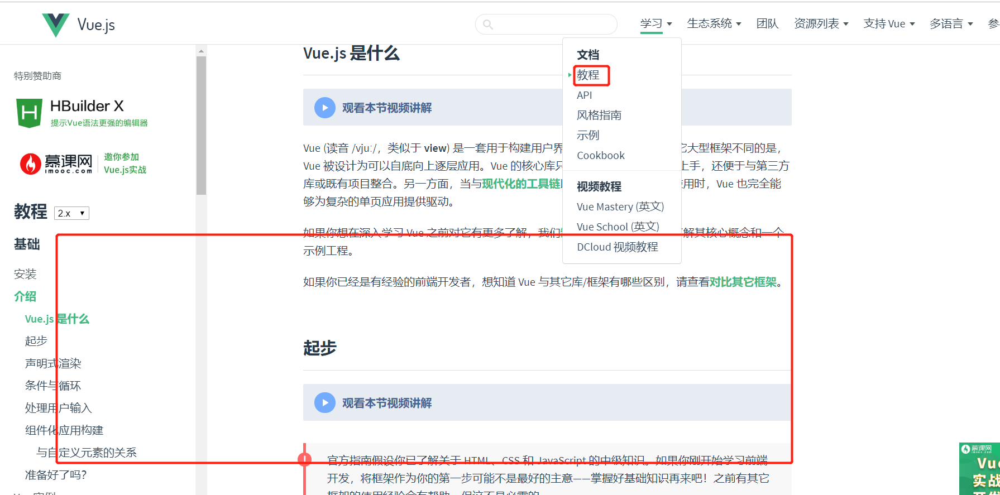

# vue和核心组件介绍

## 简介

vue官网：<https://cn.vuejs.org/v2/guide/> 上面介绍的非常详细了，可以教程查看总体用法、api查看具体组件、方法的用法。




## vue和核心组件  功能概述（对官网的补充）

### vue：

**包含 template 和script 两部分**

  template 纯粹是视图展示用的 ，如果template里面有原生的HTML标签 ，  内容要被div包含起来；template中可以包含template标签；也可以包含子组件，子组件在script中引入；即便是子组件里面也包含的有原生的HTML标签，最好也放到div中。

​     template可以放solt，插槽；这个插槽相当于占位用的，具体内容由父组件填充和显示；  父组件的child标签中内容 会填充到插槽中。this.$refs  只的是当前组件实例，如果当前组件是全局组件，就代表全局组件；如果当前组件是个子组件  就代表这个子组件；

​	双向绑定 就是在template视图层和script脚本层实现的，脚本中数据填充到视图层，视图层的数据也同时也能传递到script中方法里；

### vuex：

<https://vuex.vuejs.org/zh/>   全局状态管理  

`npm install vuex--save`

一般存放在store文件夹中，参考如下：

```
import Vue from 'vue'
import Vuex from 'vuex'
import app from './modules/app'
import user from './modules/user'
import permission from './modules/permission'
import getters from './getters'
Vue.use(Vuex)  const store = new Vuex.Store({
modules: {
app,
user,
permission
},
getters
})
……
export default store 
```

app、user、permission 这些常量存放在store/modules目录下 都要通过export  default  暴露出来然后在main.js  引入这个store,并添加到vue实例中；如果不需要保存这么多对象的状态，可以根据情况来添加。

#### 常用的有属性 或方法

state => store状态数据

 getters => 自定义常量，一般写上从state中获取token、name变量值的

mutations => 提供commit更改数据的方法，用来同步！  

actions => 调用axios编写的api，然后能返回一个Promise对象，promise的操作单独一章说明        

这是简单说明一下，Prosime 对象参数中要实现方法，用lamda表达式实现即可。如

```
(resolve, reject) => {
login(username, userInfo.password).then(response => {
const data = response.data
const tokenStr = data.tokenHead+data.token
setToken(tokenStr)
commit('SET_TOKEN', tokenStr)
resolve()   
}).catch(error => {
reject(error)
}) }) 
```

modules => 模块化Vuex，存储vuex类型的常量 

改变store中的值，都是通过commit命令的；

使用的时候 直接this.$store（store这个名字是main入口里面定义的） 后跟方法 就行


# vue-router

 路由管理，控制路由跳转到什么页面的

安装命令：`npm install vue-router --save`

这个是负载路由跳转，比较简单，也要在main.js中全局vue中引入

一般放在router目录下

使用的时候 直接this.$router（router这个名字是main入口里面定义的） 后跟方法 就行

他的api文档地址：<https://router.vuejs.org/zh/api/#router-beforeeach>

 spring框架中切面、拦截器、过滤器 类似功能都在router里面,比如拦截器实现的 登录后，才能访问某个页面，在router中的beforeEach 可以实现； 路径替换replace，登录后跳转到哪个页面 用push 以及更多用法<https://router.vuejs.org/zh/>； 

**谨记：** router 的beforeEach、 push 或其他router方法是针对前端路由的，、后端接口url  它是无法控制的，这个是axios来处理的

## axios:

 后端api交互用的，相当于jQuery开发网站的的ajax

`npm install axios --save`

官网：<https://www.npmjs.com/package/axios>   国内有其他翻译好的网站

一般放在api目录下

所有属性：


promise用法上一章有详细说明，axios 可以对发往后端数据做一些统一处理，比如每次访问后端request带上token、response时的数据 校验等。后面和结合着vue-element-admin详细说明。真实项目开发中 可以抽象出一个模板命令为request.js（或其他名称），通用配置 都可以放到这里面：


```JavaScript
const service = axios.create({
baseURL: process.env.BASE_API, // api的base_url
timeout: 15000 // 请求超时时间 }) // request拦截器
service.interceptors.request.use() 括号中可以设置带上token
service.interceptors.response.use()…… 括号里面可以对response 中报文进行判断
```


然后其他异步请求 可以基于它来扩展：

```
import request from '@/utils/request'
export function fetchList(params) {
return request({
url:'/brand/list',
method:'get',
params:params
}) }  
```

这是简单demo，详细用法后面和结合着项目说明。


**以上功能组成前端工程，开发技巧**：  所有的拦截、验证、都放在最后实现，先实现页面和数据的交互；登录和验证放在最后。

