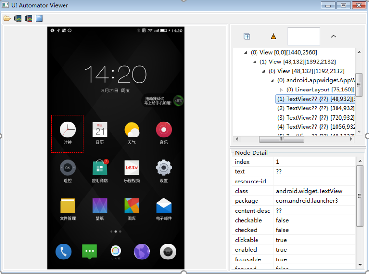

# uiautomator自动化测试原理和实现过程

## 原理阐述

​    本人从事过很长一段时间的自动化测试，其中安卓的自动化主要选用的uiautomator框架，我这里阐述一下uiautomator自动化测试的原理，从整体入手、化繁为简，可以轻松理解这款框架精妙之处。就相当于有了屋子的图纸，再分步来添砖加瓦就容易的多。

​    UIAutomator是Google开发的自动化测试工具，无需源代码，可在不同App间调度；并不需要知道程序内部的结构，通过界面来点击、返回、退出等来对程序进行测试，所以它也是黑盒测试。

​    uiautomator，把这个单词拆开ui+auto+mator,就很容易理解了，是基于UI界面然后对某个控件操作的自动化；利用uiautomator框架获取到APP 的UI（界面）上各种元素，然后实现对此app各种操作。从自带的控件获取工具uiautomatorview就可以看出来APP控件名称和方法等。



可以看出来，每一个APP图标就是一个控件（如果这里面出现了不能识别中文，把安卓设备自带uiautomator.jar替换成最新的就行了）

​    uiautomator框架是用Java语言编写的，也是三段体的，一个完整自动化过程必须包含setup 、自动化方法、  teardown 三个部分；这就像火车一样，有车头(setup)、车身(方法）、车尾(teardown)；车身（自动化方法体）具体有几节、是载货还是拉人这个每次都由自己编写代码来定义；如果方法所在的类中没有setup、teardown，自动化执行此方法时，它会直接使用（继承的）父类的setup和teardown,如果父类都没有setup和teardown，它会执行uiautomator框架顶级类中setup和teardown；setup一般用来初始化，teardown用来复位；比如你上次自动化停留在某款APP的设置界面；再次执行新的自动化方法时，先初始化到home；这样就能保证左右滑动后能找到其他APP；teardown复位呢，就相当于用例执行完成后停留APP设置界面，执行teardown复位到此APP的主页；同样车头（setup）和车尾（teardown）也可以被改造（重构）  ，定制化出来的火车能更好的适应实际生产情况。就像同一个UI（界面）就可以定义为一个特殊的火车，如设置界面中，这个界面所有控件的测试方法可以写到一个类中，共用setup和teardown；初始化（车头）都是打开应用进入我的-设置界面，并把所有开关按钮置为关闭状态；复位（复位）都是点击两次返回按钮进入到APP的初始主页中。然后再来编写某个控件测试的方法。这种三段体架构的精髓在于执行方法即可，初始化和复位无需重复编写，且自动执行，如果初始化和复位写的比较规范，相当于测试下一条用例时前置条件有了双保险；

## 代码展示

**setup重构代码：**

```java
@Override
	protected void setUp() throws Exception {
		super.setUp();
		
		initDeviceParams();

		callShell("rm -rf /data/anr");
		callShell("rm -rf /data/tombstones");

		initCaseFolder();

		registerCommonWatcher();

		if (!device.isScreenOn()) {
			device.wakeUp();
			sleepSec(1);
		}
		
		launchHomeApp();
	}

```

**方法体代码：**

```java
@CaseName("点击快捷菜单中的天气区域")
	public void clickWeatherArea() throws UiObjectNotFoundException, RemoteException {
		
		addStep("进入快捷菜单页面");
		clickExpandButtonOnStatusBar();
		sleepSec(2);
		
		addStep("发现时间区域，进入快捷菜单");
		UiObject clockBTonstatusbar= new UiObject (new UiSelector().className("android.widget.TextView")
				.resourceId("com.android.systemui:id/clock"));
		verify("没有发现账号登录按钮，进入快捷菜单失败",clockBTonstatusbar.exists());//验证功能
		
		addStep("点击天气区域");
		device.click(384, 173);
		sleepSec(2);
	
		addStep("发现天气片段，进入天气应用");
		UiObject check_weatherpage= new UiObject (new UiSelector().className("android.widget.LinearLayout")
				.resourceId("com.letv.weather:id/fragment_weather"));
		verify("没有进入天气应用",check_weatherpage.exists());
		
	}
	
```

- 一定要编写好验证的方法(verify，也可以叫其他方法名)，这点非常重要；脚本执行完成后，用例是否达到预期要用verify比对一下。

**teardown代码：**

```java
@Override
	protected void tearDown() throws Exception {

		boolean ANRFlag = false;
		boolean TombstoneFlag = false;
		
		int errorTypeCount = 0;

		callShell("/system/bin/sh /data/local/tmp/PullLog.sh " + caseFolder);
		callShell("mv /data/tombstones " + caseFolder);

		File tombstones = new File(caseFolder + File.separator + "tombstones/tombstone_00");
		File anr = new File(caseFolder + File.separator + "anr");
		callShell("mv -r /data/anr " + caseFolder);

		if (anr.exists()) {
			ANRFlag = true;
			errorTypeCount = errorTypeCount + 1;
			UiObject anrWindows = new UiObject(new UiSelector().className("android.widget.TextView").textContains("isn't responding"));
			if (anrWindows.exists()) {
				send_status(STATUS_ANR, "ANR", "Detected ANR when running case");
				takeScreenshot();
				try {
					new UiObject(new UiSelector().className("android.widget.Button").text("OK")).click();
				} catch (UiObjectNotFoundException e) {
					e.printStackTrace();
					Log.e(logTag,"OK button in anr window is gone. Is it recoverd?");
				} finally {

				}
				Log.i(logTag,"ANR has been catched and Device recovery normally!!!");
			} else {
				takeScreenshot();
				Log.i(logTag, "Can not find ANR note!!!");
			}
		}

		if (tombstones.exists()) {
			TombstoneFlag = true;
			errorTypeCount = errorTypeCount + 1;
			send_status(STATUS_TOMBSTONES, "TOMBSTONES", "Detected TOMBSTONES when running case");
			takeScreenshot();
		}
		
		unregisterCommonWatcher();

		switch (errorTypeCount) {
		case 1:
			if (ANRFlag == true) {
				Log.i(logTag, "AutoZM TestCase ended: ANR Occurred");
				fail("ANR occurred");
			}
			if (TombstoneFlag == true) {
				Log.i(logTag, "AutoZM TestCase ended: Tombstones Occurred");
				fail("TOMBSTONES occurred");
			}
			break;
		case 2:
			if (ANRFlag == true && TombstoneFlag == true) {
				Log.i(logTag, "AutoZM TestCase ended: Tombstones and ANR Occurred");
				fail("TOMBSTONES and ANR occurred");
			}
			break;
		default:
			Log.i(logTag, "AutoZM TestCase ended successfully");
			break;
		}
		
		callShell("logcat -v time -d -f " + caseFolder + File.separator + "logcat.txt");
		callShell("logcat -c");
		
		super.tearDown();
	}

	
```

- uiautomator基础对象：UiScrollable UiObject  UiSelector  UiDevice等这里不做描述，网上有很多相关资料，主要是博主这几年精力基本在运维方面，不知道是否有变化。找到某个控件一般通过UISelector().[text,textContains,resourceId,classname]都行，根据实际情况来选择，比如text名称都一样，就换一个方法来选择控件；这些属性，uiautomatorview里面都可以获取到。

- 还有一点 就是长按，这个自带的方法，如果不好使；就改用滑动来实现，在按钮上长时间滑动达到长按的效果。

  ## 脚本执行

  ### 单个方法执行比较简单：

  ####  1）把编译出来的jar包，copy到安卓设备

  ```shell
  adb push  /home/workspace/tvCar/bin/tvCar.jar   /data/local/tmp/
  ```

  ####  2）执行方法

  ```
  adb shell uiautomator runtest tvCar.jar -c com.tvCar.cases.smoke.tvTel#testHdTel（执行某一条用例方法）。
  如果用例需要传参数，执行时把参数输进去
  adb shell uiautomator runtest tvCar.jar  -c com.tvCar.cases.smoke.tvCaruser#testLoginuser -e account 152******** -e PWD zhenglin ； 
  ```

### 批量执行和报告

   如果只能上面单条用例，手动执行，那自动化也就是个弱鸡，啥也干不了；

   所以更近一步：我们可以吧所有方法list写到一个表格或者txt中，然后用shell读取后，批量执行自动化用例，把执行结果写成html，这个是重点难点；要分步实现：

#### 批量执行自动化用例

- 用例列表caselist.txt，把编写好的自动化方法存储到一个txt列表中

```
com.tv.cases.motor.login#testOpenApps
com.tv.cases.motor.login#login
com.tv.cases.motor.login#changename
com.tv.cases.motor.login#changename
```

- 编写批量执行脚本start.sh ，由于博客篇幅限制，这里节选最重要的一段代码

```shell
for ((i=1;i<=$caselistloop;i++))
do
  for line in `cat caselist.txt`
  do
    testCase=`echo $line| awk -F "," '{print $1}'`
    case_name=`echo $line|awk -F# '{print $2}'|awk -F "," '{print $1}'`
    ……
    echo ====================================== $line start ======================================
    adb -s ${IPADDRESS} shell \
    "uiautomator runtest smoke.jar -c $testCase --nohup -e disable_ime true \
    $globalvars $case_avg -e caseFolder $current_case_folder >> sdcard/case.log"
    ……
    done
done
```

caselistloop 为用例执行遍数

#### 生成报告

  这个比较复杂，本人采用的是其他团队基于（Python）Django框架编写的模板，然后来生成出html格式的报告，而且是几年前的框架了，这里就不做源码展示了；一般大公司都会有现成自动化报告框架，我们负责把自动化代码编写完成，提交到仓库，cicd会自动把这一套运行起来。

对小型公司来说，可以到GitHub上寻找开源的模板，然后稍作修改后使用；

## uiautomator自动化的局限性

   uiautomator框架需要安卓sdk的支持，sdk包非常大，下载还需要科学上网；编写还要有java语言功底，捕获UI控件来进行各种操作。最大的一个短板：如果界面是动态的，无法正常捕获到控件，采用这个框架，什么也操作不了。生成报告要借助第三方工具或者模板。   

 uiautomator自动化最适用场景是冒烟测试，那些重要的测试用例，那些改动不大的界面采用此框架进行自动化测试，再合适不过了。如果界面和控件名称改动频繁，即便用uiautomator实现了自动化测试，也得不偿失（可能会累死自动化测试工程师）。

**附：uiautomator学习网站**<https://testerhome.com/topics/node53/popular>