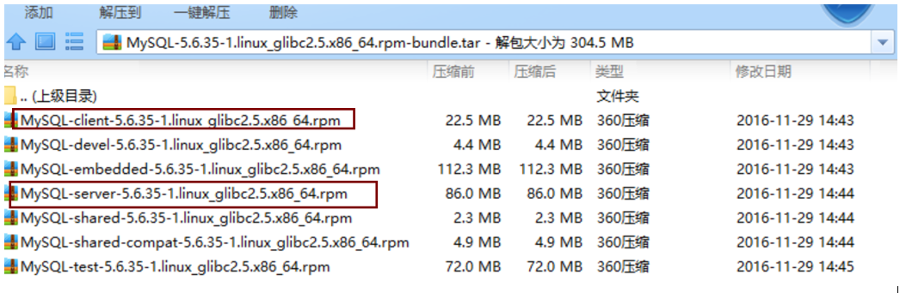

# linux中安装mysql5.6和5.7

## 安装检查

检查是否已有mariadb 数据库

`rpm -qa | grep mariadb`

如果检查出有mariadb安装文件，一定要卸载掉，否则无法安装

`rpm -e --nodeps $mariadbname （$mariadbname代表检查出来mariadb的数据库安装包名称）`

 

 


## 安装mysql5.6

官网下载下来的mysql5.6可能含有多个安装文件只需安装如图圈中的名称含有MySQL-server、MySQL-client的即可



### 1,安装

```
rpm -ivh MySQL-server*.rpm --nodeps  （去掉依赖）

rpm -ivh MySQL-client*.rpm
```


###  2，重置密码

Mysql初始化密码不知道，查找太麻烦，我们可以强制在安全模式下快速重置密码即可；

- 重置MySQL5.6 的密码

`mysqld_safe --user=mysql --skip-grant-tables --skip-networking &`

进入mysql进程后ctrl+c停止  

如果有提示：

`ERROR 2002 (HY000): Can't connect to local MySQL server through socket '/var/lib/mysql/mysql.sock' (2)`

我们可以通过启停一下MySQL让它生成mysql.sock文件

```shell
/etc/init.d/mysql start

/etc/init.d/mysql stop   
```

 

再次进入**安全模式后**，输入`mysql -u root mysql`（一定要确保是在安全模式下，如果提示Unknown database 'mysql'，去掉后面的mysql）

然后修改密码：

```bash
update user set password=password('123456') where user='root';

flush privileges;
```

然后杀掉MySQL所有进程

正常启动：`/etc/init.d/mysql start`

在正常模式下登录后`mysql -u root -p12345`

若登录成功后，无法对数据进行查看等操作，再输入下列命令，重置一下密码；

`SET PASSWORD = PASSWORD('123456');  `

 

## 安装mysql5.7

****

### 1,安装mysql5.7

```bash
rpm -ivh mysql-community-common-5.7.15-1.el6.x86_64.rpm

rpm -ivh mysql-community-libs-5.7.15-1.el6.x86_64.rpm

rpm -ivh mysql-community-client-5.7.15-1.el6.x86_64.rpm

rpm -ivh mysql-community-server-5.7.15-1.el6.x86_64.rpm
```

 

**MySQL5.7安装文件有4个，common、libs、client、server,根据linux系统版本不同选择不同的RPM包，如centos6 选择mysql-community-server-5.7.15-1.el6.x86_64.rpm，el6的安装包，7选择el7的安装包；且安装顺序必须按照文档排列**

- MySQL5.7安装成功后，会生成一个临时密码，通过如下命令，即可获得

`grep "A temporary password"  /var/log/mysqld.log`

### 2,Mysql5.7密码重置

若无法获取临时密码，或者临时密码有特殊字符，无法正确输入(加上转义字符\也不好使），也可以通过安全模式重置密码

`mysqld_safe --user=mysql --skip-grant-tables --skip-networking &`

操作步骤和上面一样，唯一区别时，5.7的密码列是authentication_string

所以要输入：

```bash
update user set authentication_string=password('123abc') where user='root';

flush privileges;
```

来修改密码，然后重启MySQL