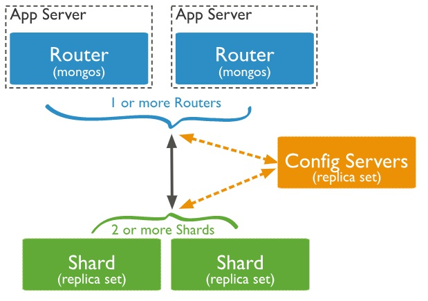

# MongoDB 分片集群


## Mongodb集群架构图



从图中可以看到有三个集群组件：mongos、config server、shard。

* mongos: 数据库集群请求的入口，所有的请求都通过mongos进行协调，不需要在应用程序添加一个路由选择器，mongos自己就是一个请求分发中心，它负责把对应的数据请求请求转发到对应的shard服务器上。在生产环境通常有多mongos作为请求的入口，防止其中一个挂掉所有的mongodb请求都没有办法操作。

* config server，顾名思义为配置服务器，存储所有数据库元信息（路由、分片）的配置。mongos本身没有物理存储分片服务器和数据路由信息，只是缓存在内存里，配置服务器则实际存储这些数据。mongos第一次启动或者关掉重启就会从 config server 加载配置信息，以后如果配置服务器信息变化会通知到所有的 mongos 更新自己的状态，这样 mongos 就能继续准确路由。在生产环境通常有多个 config server 配置服务器，因为它存储了分片路由的元数据，防止数据丢失！

* shard，分片（sharding）是指将数据库拆分，将其分散在不同的机器上的过程。将数据分散到不同的机器上，不需要功能强大的服务器就可以存储更多的数据和处理更大的负载。基本思想就是将集合切成小块，这些块分散到若干片里，每个片只负责总数据的一部分，最后通过一个均衡器来对各个分片进行均衡（数据迁移）。


简单了解之后，我们可以这样总结一下，应用请求mongos来操作mongodb的增删改查，配置服务器存储数据库元信息，并且和mongos做同步，数据最终存入在shard（分片）上，为了防止数据丢失同步在副本集中存储了一份，仲裁在数据存储到分片的时候决定存储到哪个节点。

## 环境准备

系统系统 redhat 7.2
三台服务器：
* 192.1.167.13 mongodb001
* 192.1.167.14 mongodb002
* 192.1.167.16 mongodb003

### 服务器规划


| 服务器mongodb001     | 服务器mongodb002      | 服务器mongodb003      |
| ----------------    | -----------------    | ----------------     |
| mongos              | mongos               | mongos               |
| config server       | config server        | config server        |
| shard0000  | shard0001  | shard0002   |


### 端口分配

```
mongos：20000
config：21000
shard：27001
```

### 开放端口

```
firewall-cmd --add-port=21000/tcp --permanent
firewall-cmd --add-port=21000/tcp
firewall-cmd --add-port=27001/tcp --permanent
firewall-cmd --add-port=27001/tcp
firewall-cmd --add-port=20000/tcp --permanent
firewall-cmd --add-port=20000/tcp
```

### 关闭selinux

```
vi /etc/selinux/config
SELINUX=disabled
```

重启系统才会生效

## 集群搭建

### 安装mongodb

#### 使用 `rpm install` 进行安装
在mongo安装包（3.6.8）执行下面语句：
```
sudo rpm  -ivh  *.rpm
```


#### featureCompatibilityVersion版本检查
在mongo 做shard集群前，最好要确认一下featureCompatibilityVersion版本，很多mongo是从较低版本升级到较高版本，比如从3.2升级到3.6后，featureCompatibilityVersion版本可能是3.4；所以确定featureCompatibilityVersion版本和mongod版本很有必要：
执行命令
`db.adminCommand( { getParameter: 1, featureCompatibilityVersion: 1 } )`
来查看featureCompatibilityVersion当前版本
如果featureCompatibilityVersion版本和当前使用mongo不一致，还需要执行下面代码：
`db.adminCommand( { setFeatureCompatibilityVersion: "3.6" } )`
其中 setFeatureCompatibilityVersion: <version>  version参数要根据当前使用mongo版本来定；
具体执行过程如下：

```
[root@apptrace_pak ~]# mongo
MongoDB shell version v3.6.8
connecting to: mongodb://127.0.0.1:27017
MongoDB server version: 3.6.8
Server has startup warnings:
2018-10-08T13:51:28.737+0800 I CONTROL  [initandlisten]
2018-10-08T13:51:28.737+0800 I CONTROL  [initandlisten] ** WARNING: Access control is not enabled for the database.
2018-10-08T13:51:28.737+0800 I CONTROL  [initandlisten] **          Read and write access to data and configuration is unrestricted.
2018-10-08T13:51:28.737+0800 I CONTROL  [initandlisten]
2018-10-08T13:51:28.737+0800 I CONTROL  [initandlisten] ** WARNING: This server is bound to localhost.
2018-10-08T13:51:28.737+0800 I CONTROL  [initandlisten] **          Remote systems will be unable to connect to this server.
2018-10-08T13:51:28.737+0800 I CONTROL  [initandlisten] **          Start the server with --bind_ip <address> to specify which IP
2018-10-08T13:51:28.737+0800 I CONTROL  [initandlisten] **          addresses it should serve responses from, or with --bind_ip_all to
2018-10-08T13:51:28.737+0800 I CONTROL  [initandlisten] **          bind to all interfaces. If this behavior is desired, start the
2018-10-08T13:51:28.737+0800 I CONTROL  [initandlisten] **          server with --bind_ip 127.0.0.1 to disable this warning.
2018-10-08T13:51:28.737+0800 I CONTROL  [initandlisten]
> db.adminCommand( { getParameter: 1, featureCompatibilityVersion: 1 } )
{ "featureCompatibilityVersion" : { "version" : "3.4" }, "ok" : 1 }
> db.adminCommand( { setFeatureCompatibilityVersion: "3.6" } )
{ "ok" : 1 }
> db.adminCommand( { getParameter: 1, featureCompatibilityVersion: 1 } )
{ "featureCompatibilityVersion" : { "version" : "3.6" }, "ok" : 1 }
>
```


#### 禁用自带服务：

```
systemctl disable mongod
systemctl stop mongod

```

#### 路径规划并创建

分别在每台机器建立conf、mongos、config、shard、目录，因为mongos不存储数据，只需要建立日志文件目录即可。

##### 配置文件路径

```
mkdir -p /etc/mongod/conf.d
```

##### pid文件路径

```
/var/run/mongodb
```

##### 数据存储路径

###### config和shard server数据存储路径

```
mkdir -p  $APPTRACE_HOME/mongodb/db/shard/data
mkdir -p  $APPTRACE_HOME/mongodb/db/config/data
chown -R mongod:mongod $APPTRACE_HOME/mongodb
```
`需要注意的是，如果$APPTRACE_HOME真实路径是/app/apptrace ，一定要保证当前账号对/app目录有读写执行权限；(很重要)`

#### 日志文件路径

```
/var/log/mongodb
```

### 2、config server配置服务器

#### 添加配置文件

```
cp /etc/mongod.conf /etc/mongod/conf.d/config.conf

vi /etc/mongod/conf.d/config.conf
```

配置文件内容:

```
# config.conf

# for documentation of all options, see:
#   http://docs.mongodb.org/manual/reference/configuration-options/

# where to write logging data.
systemLog:
  destination: file
  logAppend: true
  path: /var/log/mongodb/configsvr.log

# Where and how to store data.
storage:
  dbPath: $APPTRACE_HOME/mongodb/db/config/data
  journal:
    enabled: true
#  engine:
#  mmapv1:
#  wiredTiger:

# how the process runs
processManagement:
  fork: true  # fork and run in background
  pidFilePath: /var/run/mongodb/configsvr.pid  # location of pidfile
  timeZoneInfo: /usr/share/zoneinfo

# network interfaces
net:
  port: 21000
  bindIp: 0.0.0.0  # Listen on all interfaces.
  maxIncomingConnections: 20000

#security:

#operationProfiling:

#replication:
replication:
  replSetName: csReplSet

#sharding:
sharding:
  clusterRole: configsvr

## Enterprise-Only Options

#auditLog:

#snmp:

```

创建systemctl unit文件mongod-configsvr.service

```
cp /usr/lib/systemd/system/mongod.service /usr/lib/systemd/system/mongod-configsvr.service

vi /usr/lib/systemd/system/mongod-configsvr.service
```


```
[Unit]
Description=Mongodb Config Server
After=network.target
Documentation=https://docs.mongodb.org/manual

[Service]
User=mongod
Group=mongod
Environment="OPTIONS=-f /etc/mongod/conf.d/config.conf"
ExecStart=/usr/bin/mongod $OPTIONS
ExecStartPre=/usr/bin/mkdir -p /var/run/mongodb
ExecStartPre=/usr/bin/chown mongod:mongod /var/run/mongodb
ExecStartPre=/usr/bin/chmod 0755 /var/run/mongodb
PermissionsStartOnly=true
PIDFile=/var/run/mongodb/configsvr.pid
Type=forking
# file size
LimitFSIZE=infinity
# cpu time
LimitCPU=infinity
# virtual memory size
LimitAS=infinity
# open files
LimitNOFILE=64000
# processes/threads
LimitNPROC=64000
# locked memory
LimitMEMLOCK=infinity
# total threads (user+kernel)
TasksMax=infinity
TasksAccounting=false
# Recommended limits for for mongod as specified in
# http://docs.mongodb.org/manual/reference/ulimit/#recommended-settings

[Install]
WantedBy=multi-user.target

```

在另外两台上执行上面同样的操作，可以把上面两个文件复制到另外两个文件

```

scp root@ip:/etc/mongod/conf.d/config.conf /etc/mongod/conf.d/config.conf

scp root@ip:/usr/lib/systemd/system/mongod-configsvr.service /usr/lib/systemd/system/mongod-configsvr.service

```
在安徽移动这个方法不好使，直接一台手动复制的；

#### 启动三台服务器的config server

```

systemctl enable mongod-configsvr
systemctl start mongod-configsvr

```

#### 初始化配置

登录任意一台配置服务器

```

#连接
mongo 127.0.0.1:21000
#config变量
config = {
        _id : "csReplSet",
        members : [
          {_id : 1, host : "10.243.167.13:21000" },
          {_id : 2, host : "10.243.167.14:21000" },
          {_id : 3, host : "10.243.167.16:21000" }
        ]
}

```

初始化

```

rs.initiate(config)

```

执行结果：

```

> rs.initiate(config);
{
        "ok" : 1,
        "operationTime" : Timestamp(1537320975, 1),
        "$gleStats" : {
                "lastOpTime" : Timestamp(1537320975, 1),
                "electionId" : ObjectId("000000000000000000000000")
        },
        "$clusterTime" : {
                "clusterTime" : Timestamp(1537320975, 1),
                "signature" : {
                        "hash" : BinData(0,"AAAAAAAAAAAAAAAAAAAAAAAAAAA="),
                        "keyId" : NumberLong(0)
                }
        }
}

```


其中，"_id" : " csReplSet "应与配置文件中配置的 replicaction.replSetName 一致，"members" 中的 "host" 为三个节点的 ip 和 port

### 3、配置分片(三台机器)

#### 1)	设置分片

##### 添加配置文件

```
cp /etc/mongod.conf /etc/mongod/conf.d/shard.conf

vi /etc/mongod/conf.d/shard.conf

```

配置文件内容

```

systemLog:
  destination: file
  logAppend: true
  path: /var/log/mongodb/shard.log
storage:
  dbPath: $APPTRACE_HOME/mongodb/db/shard/data
  journal:
    enabled: true

processManagement:
  fork: true
  pidFilePath: /var/run/mongodb/shard.pid
  timeZoneInfo: /usr/share/zoneinfo

net:
  port: 27001
  bindIp: 0.0.0.0
  maxIncomingConnections: 20000

#replication:
#  replSetName: shard

sharding:
  clusterRole: shardsvr

```

创建systemctl unit文件mongod-shard.service

```

cp /usr/lib/systemd/system/mongod.service /usr/lib/systemd/system/mongod-shard.service


vi  /usr/lib/systemd/system/mongod-shard.service
```

`mongod-shard.service`配置文件内容

```

[Unit]
Description=Mongodb shard Server
After=network.target
Documentation=https://docs.mongodb.org/manual

[Service]
User=mongod
Group=mongod
Environment="OPTIONS=-f /etc/mongod/conf.d/shard.conf"
ExecStart=/usr/bin/mongod $OPTIONS
ExecStartPre=/usr/bin/mkdir -p /var/run/mongodb
ExecStartPre=/usr/bin/chown mongod:mongod /var/run/mongodb
ExecStartPre=/usr/bin/chmod 0755 /var/run/mongodb
PermissionsStartOnly=true
PIDFile=/var/run/mongodb/shard.pid
Type=forking
# file size
LimitFSIZE=infinity
# cpu time
LimitCPU=infinity
# virtual memory size
LimitAS=infinity
# open files
LimitNOFILE=64000
# processes/threads
LimitNPROC=64000
# locked memory
LimitMEMLOCK=infinity
# total threads (user+kernel)
TasksMax=infinity
TasksAccounting=false
# Recommended limits for for mongod as specified in
# http://docs.mongodb.org/manual/reference/ulimit/#recommended-settings

[Install]
WantedBy=multi-user.target

```

在另外两台上执行同样操作，可以把这两个文件内容粘贴到另外两台机器，如果可以使用scp copy的话，可以参考下面方式

```

scp root@ip:/etc/mongod/conf.d/shard.conf /etc/mongod/conf.d/shard.conf
scp root@ip:/usr/lib/systemd/system/mongod-shard.service /usr/lib/systemd/system/mongod-shard.service

```

##### 启动三台服务器的shard server

```

systemctl enable mongod-shard
systemctl start mongod-shard

```

### 4、配置路由服务器 mongos

先启动配置服务器和分片服务器,后启动路由实例启动路由实例:（三台机器）

#### 添加配置文件

```
cp /etc/mongod.conf /etc/mongod/conf.d/mongos.conf

vi /etc/mongod/conf.d/mongos.conf

```

修改配置文件内容

```

systemLog:
  destination: file
  logAppend: true
  path: /var/log/mongodb/mongos.log

processManagement:
  fork: true
  pidFilePath: /var/run/mongodb/mongos.pid
  timeZoneInfo: /usr/share/zoneinfo

net:
  port: 20000
  bindIp: 0.0.0.0
  maxIncomingConnections: 20000

sharding:
  configDB: csReplSet/10.243.167.13:21000, 10.243.167.14:21000, 10.243.167.16:21000

#注意监听的配置服务器,只能有1个或者3个 csReplSet为配置服务器的名字

```

创建systemctl unit文件mongod-mongos.service

```

cp /usr/lib/systemd/system/mongod.service /usr/lib/systemd/system/mongod-mongos.service

vi /usr/lib/systemd/system/mongod-mongos.service

```


```

[Unit]
Description=Mongodb Mongos Server
After=network.target mongod-shard.service
Documentation=https://docs.mongodb.org/manual

[Service]
User=mongod
Group=mongod
Environment="OPTIONS=-f /etc/mongod/conf.d/mongos.conf"
ExecStart=/usr/bin/mongos $OPTIONS   ##注意是mongos
ExecStartPre=/usr/bin/mkdir -p /var/run/mongodb
ExecStartPre=/usr/bin/chown mongod:mongod /var/run/mongodb
ExecStartPre=/usr/bin/chmod 0755 /var/run/mongodb
PermissionsStartOnly=true
PIDFile=/var/run/mongodb/mongos.pid
Type=forking
# file size
LimitFSIZE=infinity
# cpu time
LimitCPU=infinity
# virtual memory size
LimitAS=infinity
# open files
LimitNOFILE=64000
# processes/threads
LimitNPROC=64000
# locked memory
LimitMEMLOCK=infinity
# total threads (user+kernel)
TasksMax=infinity
TasksAccounting=false
# Recommended limits for for mongod as specified in
# http://docs.mongodb.org/manual/reference/ulimit/#recommended-settings

[Install]
WantedBy=multi-user.target

```

在另外两台上执行，同样操作；


#### 启动三台服务器的mongos server

```

systemctl enable mongod-mongos
systemctl start mongod-mongos

```

### 5、启用分片

目前搭建了mongodb配置服务器、路由服务器，各个分片服务器，不过应用程序连接到mongos路由服务器并不能使用分片机制，还需要在程序里设置分片配置，让分片生效。

把集群机器中所有shard、configsvr、mongos都停掉；删除他们目录下面的数据，然后按照configsvr，shard顺序在集群中都启动起来，然后只启动任意一台mongos，登录后执行如下命令

```
mongo 127.0.0.1:20000
#使用admin数据库
use  admin
#串联路由服务器与分配

sh.addShard("10.243.167.13:27001")
每添加一台shard，在其shard服务器上验证一下
登录shard
mongo 127.0.0.1:27001
再执行
db.adminCommand( { shardingState: 1 })
来验证shard添加是否成功

sh.addShard("10.243.167.14:27001")
后也按照上面的验证
sh.addShard("10.243.167.16:27001")
同样按照上面的验证
```
执行结果：

```
mongos> use admin;
switched to db admin
mongos> sh.addShard("10.243.167.13:27001")
{
        "shardAdded" : "shard0000",
        "ok" : 1,
        "operationTime" : Timestamp(1538214138, 6),
        "$clusterTime" : {
                "clusterTime" : Timestamp(1538214138, 6),
                "signature" : {
                        "hash" : BinData(0,"AAAAAAAAAAAAAAAAAAAAAAAAAAA="),
                        "keyId" : NumberLong(0)
                }
        }
}
```

`验证shard `

```

mongo 127.0.0.1:27001
MongoDB shell version v3.6.7
connecting to: mongodb://127.0.0.1:27001/test
MongoDB server version: 3.6.7
Server has startup warnings:
2018-10-08T09:53:42.486+0800 I CONTROL  [initandlisten]
2018-10-08T09:53:42.486+0800 I CONTROL  [initandlisten] ** WARNING: Access control is not enabled for the database.
2018-10-08T09:53:42.486+0800 I CONTROL  [initandlisten] **          Read and write access to data and configuration is unrestricted.
2018-10-08T09:53:42.486+0800 I CONTROL  [initandlisten]
2018-10-08T09:53:42.486+0800 I CONTROL  [initandlisten]
2018-10-08T09:53:42.486+0800 I CONTROL  [initandlisten] ** WARNING: /sys/kernel/mm/transparent_hugepage/enabled is 'always'.
2018-10-08T09:53:42.486+0800 I CONTROL  [initandlisten] **        We suggest setting it to 'never'
2018-10-08T09:53:42.486+0800 I CONTROL  [initandlisten]
2018-10-08T09:53:42.486+0800 I CONTROL  [initandlisten] ** WARNING: /sys/kernel/mm/transparent_hugepage/defrag is 'always'.
2018-10-08T09:53:42.486+0800 I CONTROL  [initandlisten] **        We suggest setting it to 'never'
2018-10-08T09:53:42.486+0800 I CONTROL  [initandlisten]
shard1:PRIMARY> db.adminCommand( { shardingState: 1 })
{
        "enabled" : true,
        "configServer" : "csReplSet/172.16.33.51:21000,172.16.33.52:21000,172.16.33.53:21000",
        "shardName" : "shard1",
        "clusterId" : ObjectId("5ba1a81dd8bb342cc9d2f391"),
        "versions" : {
          ……
          },
          "ok" : 1,
          "operationTime" : Timestamp(1538994543, 1),
          "$gleStats" : {
                  "lastOpTime" : Timestamp(0, 0),
                  "electionId" : ObjectId("7fffffff0000000000000005")
          },
          "$configServerState" : {
                  "opTime" : {
                          "ts" : Timestamp(1538994539, 2),
                          "t" : NumberLong(3)
                  }
          },
          "$clusterTime" : {
                  "clusterTime" : Timestamp(1538994543, 1),
                  "signature" : {
                          "hash" : BinData(0,"AAAAAAAAAAAAAAAAAAAAAAAAAAA="),
                          "keyId" : NumberLong(0)
                  }
          }
  }
其他几台shard服务器执行过程类型，不再粘贴执行过程；

```

#### 查看集群状态

sh.status()

```

mongos> sh.status()sh.status()
--- Sharding Status ---
  sharding version: {
        "_id" : 1,
        "minCompatibleVersion" : 5,
        "currentVersion" : 6,
        "clusterId" : ObjectId("5baf35bdf7644518088915af")
  }
  shards:
        {  "_id" : "shard0000",  "host" : "10.243.167.13:27001",  "state" : 1 }
        {  "_id" : "shard0001",  "host" : "10.243.167.14:27001",  "state" : 1 }
        {  "_id" : "shard0002",  "host" : "10.243.167.16:27001",  "state" : 1 }
  active mongoses:
        "3.6.8" : 3
  autosplit:
        Currently enabled: yes
  balancer:
        Currently enabled:  yes
        Currently running:  no
        Failed balancer rounds in last 5 attempts:  0
        Migration Results for the last 24 hours:
                No recent migrations
  databases:
        {  "_id" : "config",  "primary" : "config",  "partitioned" : true }

```
然后再把剩下的mongos启动；

### 6、测试

目前配置服务、路由服务、分片服务、服务都已经串联起来了，但我们的目的是希望插入数据，数据能够自动分片。连接在mongos上，准备让指定的数据库、指定的集合分片生效。

```

mongo 127.0.0.1:20000
show dbs
 use config

mongos> db.settings.find()
先查看默认chunk大小


#设置分片chunk大小
use config
db.settings.save({ "_id" : "chunksize", "value" : 1 })
设置1M是为了测试，否则要插入大量数据才能分片。最后再改回默认大小（64）
db.settings.save({ "_id" : "chunksize", "value" : 64 })
#指定test分片生效
sh.enableSharding("test")
执行结果：

{
        "ok" : 1,
        "operationTime" : Timestamp(1538214554, 9),
        "$clusterTime" : {
                "clusterTime" : Timestamp(1538214554, 9),
                "signature" : {
                        "hash" : BinData(0,"AAAAAAAAAAAAAAAAAAAAAAAAAAA="),
                        "keyId" : NumberLong(0)
                }
        }
}


#指定数据库里需要分片的集合和片键
use test
db.users.createIndex({user_id : 1})

use admin
sh.shardCollection("test.users", {user_id: 1})

```

我们设置testdb的 table1 表需要分片，根据 user_id 自动分片到 shard0000   shard0001   shard0002。要这样设置是因为不是所有mongodb 的数据库和表 都需要分片！

测试分片配置结果

```
mongo  127.0.0.1:20000

use test;

for (var i = 1; i <=100000; i++){
db.users.save({user_id: i, username: "user"+i});
}

#查看分片情况如下，部分无关信息省掉了

sh.status()

mongos> sh.status()
--- Sharding Status ---
  sharding version: {
        "_id" : 1,
        "minCompatibleVersion" : 5,
        "currentVersion" : 6,
        "clusterId" : ObjectId("5ba1a81dd8bb342cc9d2f391")
  }

```

可以看到相关数据分片

## 集群起停(注意顺序)

### 启动

mongodb的启动顺序是，先启动配置服务器，在启动分片，最后启动mongos.

```
systemctl start mongod-configsvr
systemctl start mongod-shard
systemctl start mongod-mongos
```

### 关闭:
```
systemctl stop mongod-mongos
systemctl stop mongod-shard
systemctl stop mongod-configsvr
```
