# pipeline风格的构建

pipeline顾名思义，流水线；这种风格job具有良好的阅读性；这里重点要说的是传统pipeline和多分支pipeline两种构建方式；

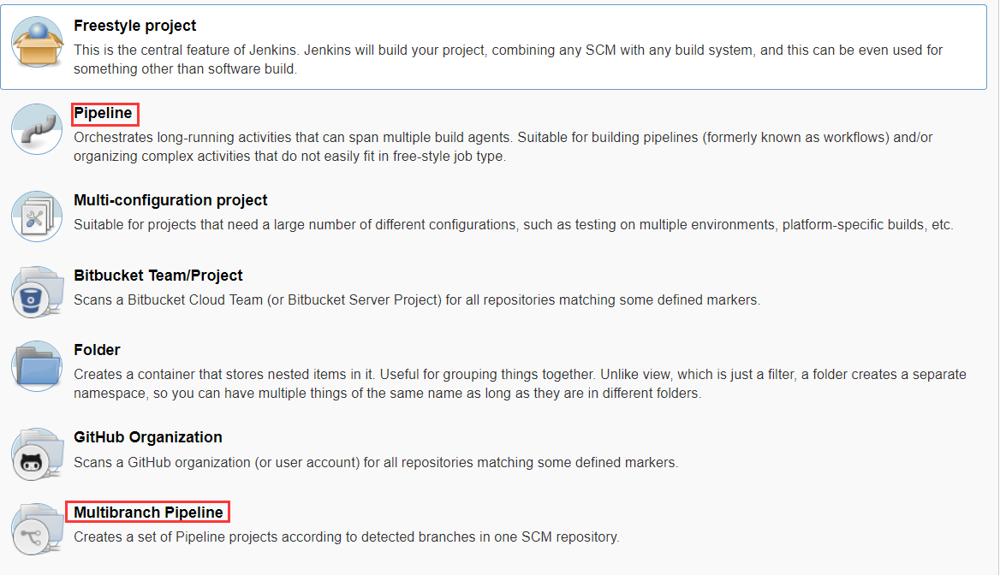

如上图所示两种pipeline

- pipeline就是传统的流水线构建，构建过程用（groove）script语言 按照先后步骤、写出来。构建完成后，可以看出各个步骤构建用时，和构建情况。
- Multibranch Pipeline 相当于pipeline的加强版，把构建用的脚本直接和源码一起存储在仓库；这样Jenkins和仓库连接后，获取脚本文件jenkinsfile后 就能执行jenkinsfile里面脚本；如果分支里面没有jenkinsfile，Jenkins则无法基于此分支构建。 jenkinsfile好处在于语法不光可以使用传统的script形式的，且可以更好的支持申明式语法；申明式语法以后会成为主流，这种语法可读性、可理解性好。如果jenkins安装了blue ocean可视化插件，可直接进行可视化编写、修改脚本，完成后；自动生成jenkinsfile，然后提交到代码仓库。

## pipeline

- 新建页面，给job命名后直接选择pipeline风格
  然后在job里面会有个pipeline脚本输入框；我们需要提前把构建过程、构建步骤罗列出来；

  如：1，选择构建节点机=>拉取代码=>编译=>打包=>存档

    2，拉取代码=>编译 =>部署 =>发送邮件

  这些构建步骤、流程要根据实际生产情况来决定。每一步的构建目的可以作为stage的名称。


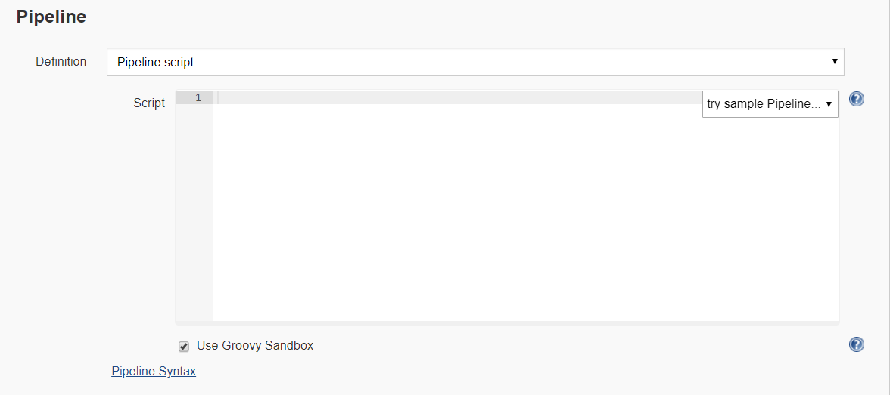

在输入框下面有个"Pipeline  Syntax"语法翻译器,这个特别有用。比如说从某个项目拉取代码的脚本不会写，可以参照下图，把要操作的步骤配置后，点击"Generate Pipeline Script"

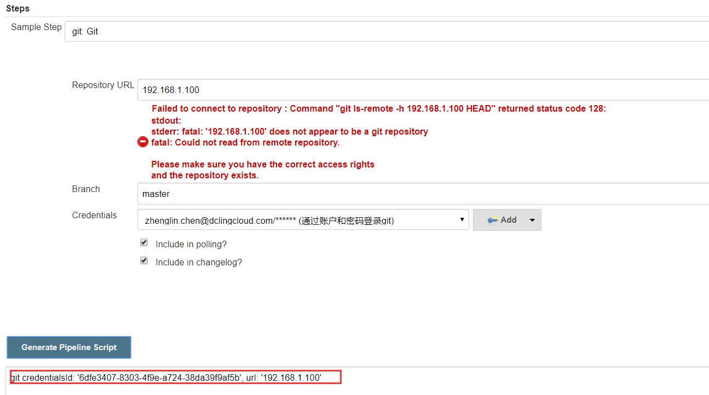

就自动生成了script，把这个脚本粘贴到pipeline 输入框即可。

申明式指令生成器

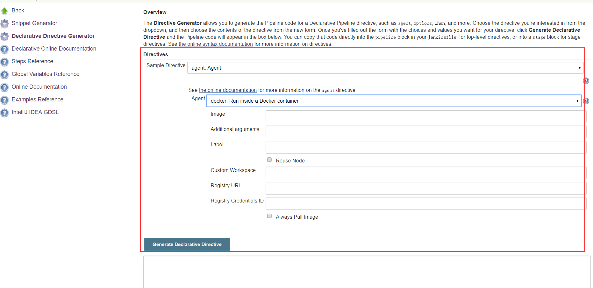

这里面生成语法都是基于申明式语法的。

全局变量

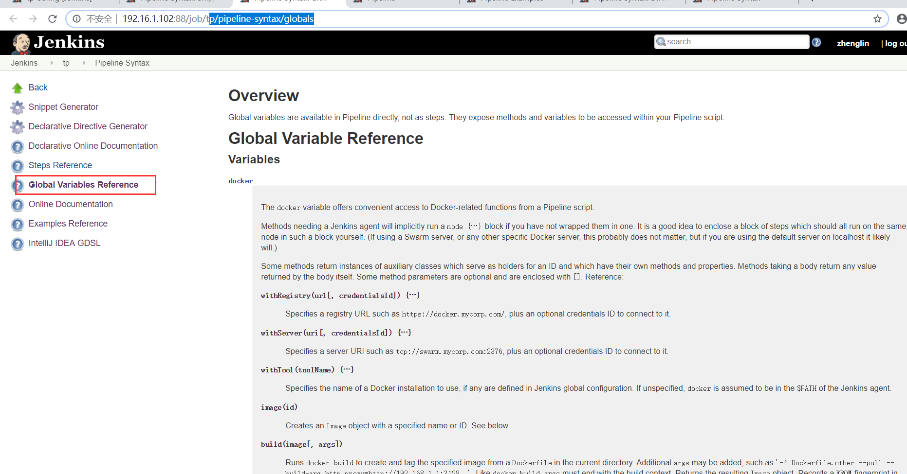

这里面提供pipeline 可能会用到的变量。

下面是jenkins官方提供pipeline例子，我们可以借鉴着编写。

<https://jenkins.io/doc/pipeline/examples/>

这里提供一个简单的script示例。


```bash
node {
   stage('拉取代码') {
     git credentialsId: '0e9c3bxxxxxx', url: ' git@git.xxxx.com:platform/xxr.git'
   }
    stage('编译') {
    dir('./') {
     sh '/data/local/maven-3.5.4/bin/mvn clean install -DskipTests=true'
       }
    }
    stage('镜像构建') {
    dir('./') {
        docker.build("git@git.xxxx.com:platform /test_pipeline:prod-${BUILD_ID}").push()
       }
    } 
    stage('镜像构建') {
    dir('./') {
        rancher confirm: false, credentialId: 'xxxxxxxxxxxxxxxxxxxxx', endpoint: 'http://docker仓库地址:8080/v2', environmentId: '1a5', environments: '', image: 'docker仓库ip/ test_pipeline:prod-${BUILD_ID}', ports: '', service: 'project /test_pipeline_1', timeout: 50
       }
    }      
}
```

构建成功后，每一步都有详细构建用时

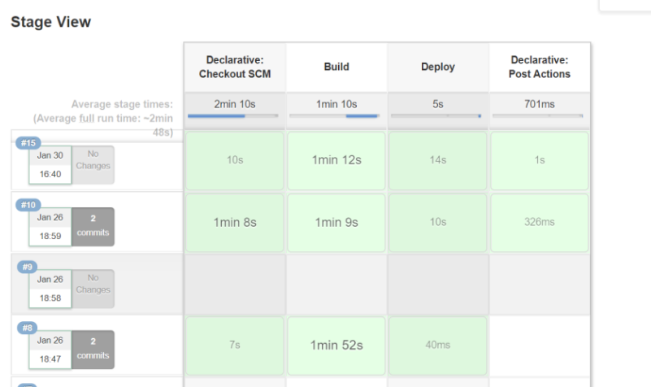

**Pipeline使用语法详解：**

[**https://jenkins.io/doc/book/pipeline/syntax/**](https://jenkins.io/doc/book/pipeline/syntax/)**（官方文档，英文）**

[**https://blog.csdn.net/diantun00/article/details/81075007**](https://blog.csdn.net/diantun00/article/details/81075007)**（中文翻译版）**


## Multibranch Pipeline

### 新增多分支pipeline

- 把jenkins调整到blueocean模式下，然后创建(Multibranch)Pipeline

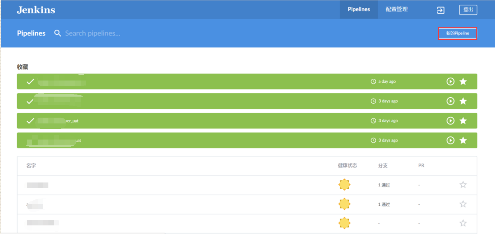

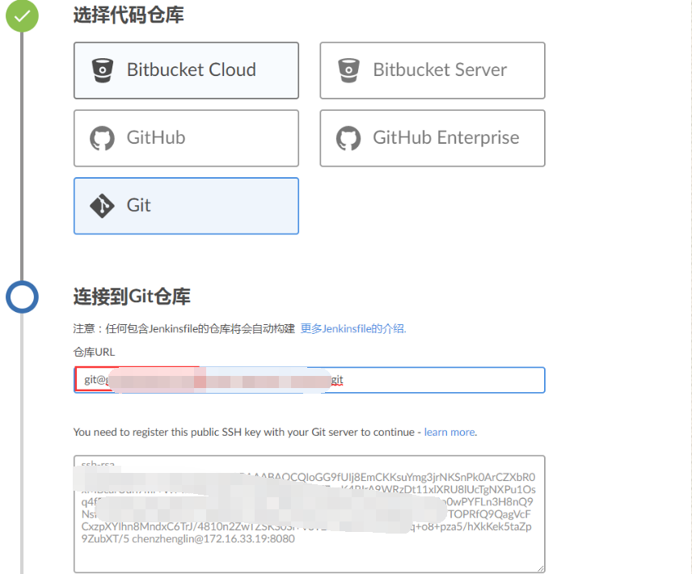

需要注意的是，如果git仓库是在本地，没有全局域名最好填写ip；jenkins主机的公钥填进去。

1，要确保自己有新创建分支的权限 2，如果没有创建分支的权限，可以让管理员给自己创建一个自己提交合并代码的分支；

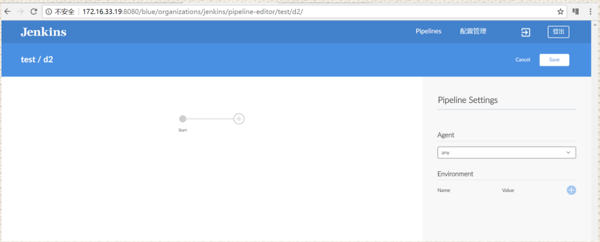

然后选择此分支进行编辑，如果使用节点机构建的话，在agent中选择node（节点机），若本机选择master即可，若不依赖环境可以选择any;如果有docker环境也可以选；Lable选择节点机名称（提前在node里面配置好节点，保持jenkins与节点机的连接状态）；

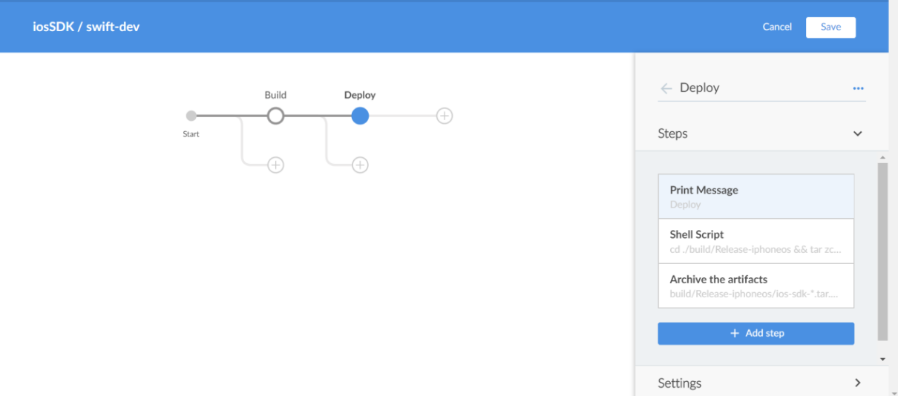

也可以使用ctrl +s组合键进入快捷编辑界面，直接编写脚本

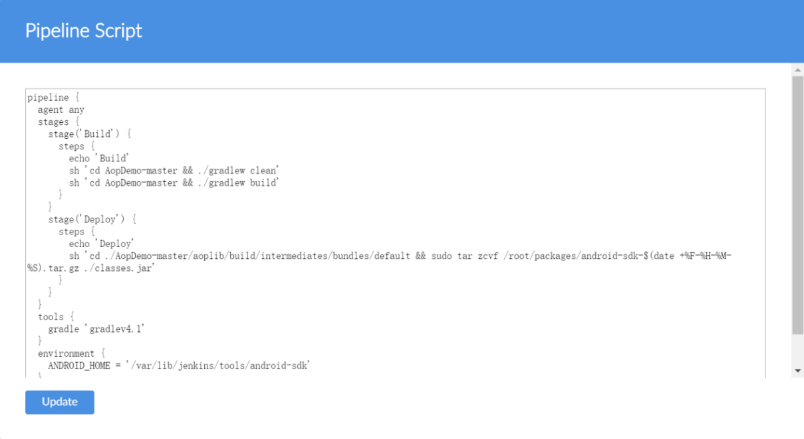

完成后保存，提交后，代码仓库中会多出一个Jenkinsfile（首字母J是大写的）文件，存放我们刚才编辑生成的脚本；可以在仓库中打开一下Jenkinsfile，查看一下是否正确。需要注意的时，这个编译脚本只针对当前分支，如果以后的分支都想使用；可以把Jenkinsfile都带上，如果编译有差异，可以再通过界面进行修改和微调。

**特别注意：不能在当前分支修改后，提交到另一个分支；如在dev分支修改jenkinsfile后，选择提交到master分支，这些会把master分支覆盖掉；可以在本地修改jenkinsfile，再单独把Jenkinsfile，cherry-pick 或checkout 到master中**

关于触发器，其他配置的语法，可以自行阅读官网文档，非常详细。

<https://jenkins.io/doc/book/pipeline/syntax/>

说明文档相关截图和说明

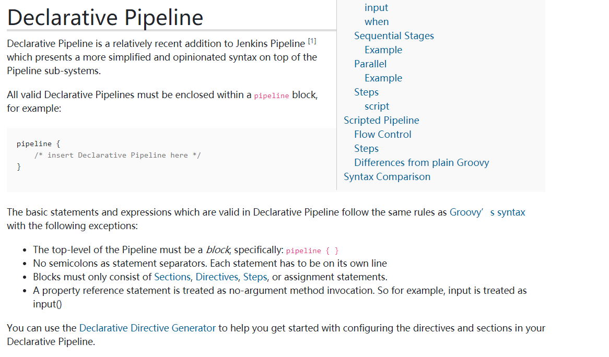

说pipeline采用了申明式语法，语法的要求等。

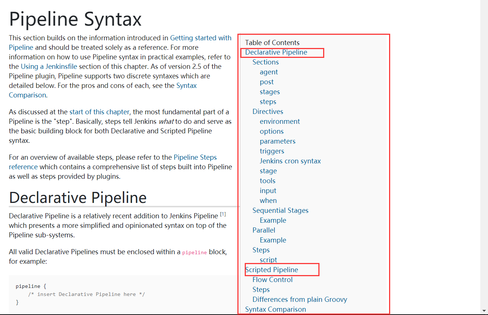

右侧目录树，展示了申明式和脚本式语法几大模块。

使用blue ocean 模式编译pipeline好处在于能可视化进行操作，自动生成pipeline 代码，如果可视化里面提供的功能不够，可以ctrl+s，切换到源码界面，然后对照pipeline语法，进行完善。

如果有新增分支了，job页面没有发现，可以在配置页面中点击" Scan Multibranch Pipeline Now"   发现新增的分支。但它有个缺点，把所有有更新的分支 都执行一遍。

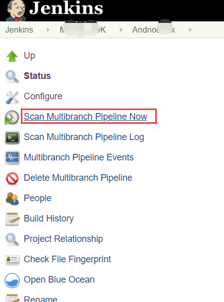

#### Jenkinsfile 代码示例

```
pipeline {
  agent {
    node {
      label 'master'
    }
    
  }
  stages {
    stage('Build') {
      steps {
        echo 'Build'
        sh 'sudo chmod  755 deploy/scripts/jenkins/build.sh &&./deploy/scripts/jenkins/build.sh'
      }
    }
    stage('Deploy') {
      steps {
        echo 'Deploy'
        sh 'rm  -rf  app_receiver*.tar.gz'
        sh 'tar   -czvf    app_receiver_${BRANCH_NAME}.tar.gz   *   --exclude=.git* '
      }
    }
    stage('archive_file') {
      steps {
        echo 'tar app_receiver'
        archiveArtifacts(artifacts: 'app_receiver*.tar.gz', onlyIfSuccessful: true)
      }
    }
  }
  tools {
    nodejs 'nodejsv9'
  }
  triggers {
    pollSCM('H */4 * * 1-5')
  }
}
```


### 如何把带有Jenkinsfile的源码纳入到现有Jenkins平台	

- 1，先建一个Multibranch Pipeline 风格的job

- 2，填写有jenkinsfile文件的仓库地址

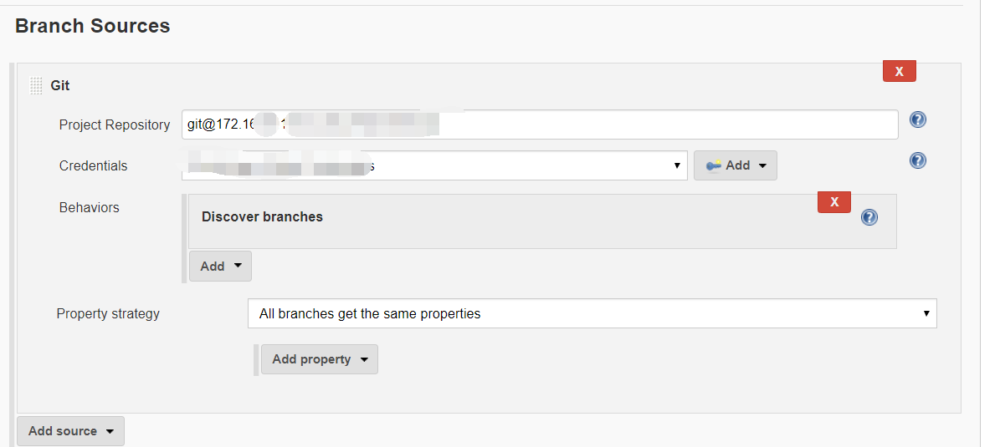

- 3，点击保存后，自动发现和运行
- 4，在可视化环境中或者clone源码后修改Jenkinsfile中已经不适用的地方；


## jenkins操作手册说明

官方操作手册地址：<https://jenkins.io/doc/book/> 这个第一手权威资料；但是英文的，没办法；一手资料一般都是英文的；如果英文不好，可以Chrome自动翻译，若嫌翻译效果差；或找到中文社区的翻译版，毕竟国内大神不是一般的多。


## 总结以及插件在jenkins中地位

jenkins工作原理：通过向节点机（或本机）注入agent后，然后通过ssh调用节点机，利用安装的插件执行各种操作及命令，如编译，打包存档等。 再加上各种执行限定条件，如构建时间，构建条件；脚本命令等。

可以说插件是jenkins的灵魂了，如果只安装jenkins没有插件，可能什么也干不了；怎么从上千种插件中快速找到真正所需的插件，这就是积累的过程。这里总结两点，1，所有插件（不管是安装的还是未安装的）点击后，都可以跳转到说明和示例页面；2，要掌握搜索技巧，比如搜索一个copy 存档用的插件，就搜copy；在结果页面，快速浏览一遍后，就基本能锁定大概范围，这个时候逐个点击查看示例页面。

常用编译插件：安卓编译工具gradle，xcode可以从Mac机上调用；

