# 利用jmeter模拟手机接口测试

本文示例是从网上找到的月光茶人APP程序

## 首先手机操作月光茶人app一个完整的购买支付流程

- 我们在监听平台中查看其产生的url（接口），下列列表为手机操作支付流程时，监听平台采集到数据


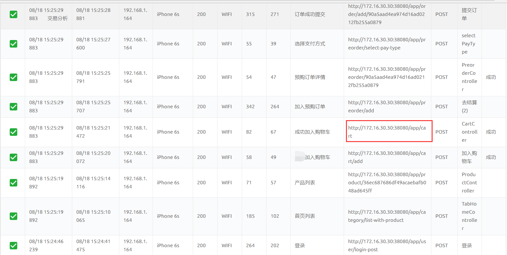

  现实测试的APP，我们可以通过开发提供的api文档、抓包工具如fiddler，抓取app的访问请求，都可以获取到接口URL；如何获取具体接口需要灵活应变；通过浏览器访问的程序可以直接通过Chrome调试network就能获取到接口URL.

- 上面列表是手机操作月光茶人APP：登录、首页列表、产品列表、加入购物车、成功加入到购物车、加入预购订单、预购订单详情、选择支付、订单提交成功产生的URL接口； 这9步构成一个完整的流程；我们把这9步的http请求加入到jmeter里面


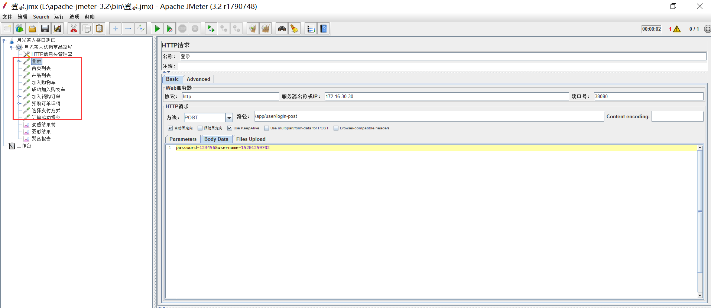

- 通过监控平台采集到URL进行分析，发现其他步骤会用到登录后产生的返回体里面appCartCookieId和appLoginToken动态参数，所以我们要在登录请求后面加入正则表达式提取器 来提取，它返回的参数


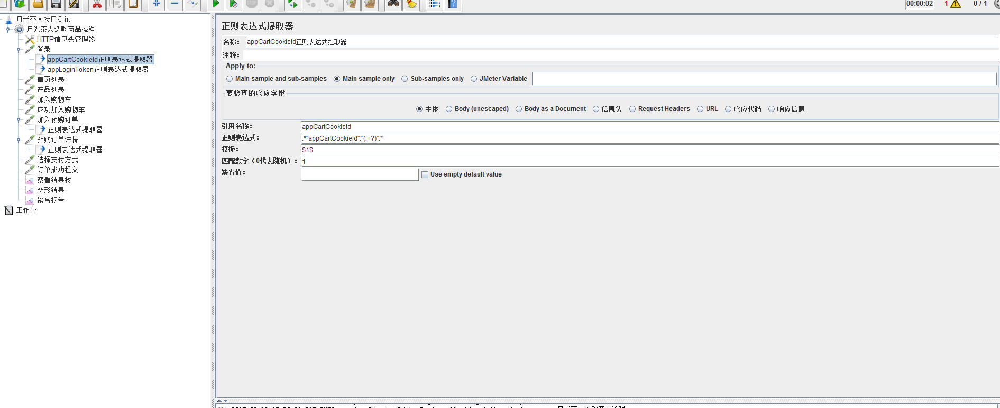

 

  .*"appCartCookieId":"(.+?)".* 这个正则表达式 要提取appCartCookieId：后面""里面包含的内容

$1$表示  当有多个正则表达式时，只获取第一个，匹配数字1，表示从第一个开始；匹配数字，-1表示取出所有匹配值  0是随机，1 、2 表示匹配第几个

​    如果有多个值和appCartCookieId匹配，一定要用$1$这种形式来选择值，若有极端情况，有多个匹配值且位置不定 如：“address":{"area":{"store_id":"1","shippingGroup":"","pathNames":"中国/广东省/深圳市/宝安区/福永/福围-下沙南","name":"福围-下沙南","id":"1000000","pathNames4Print":"深圳市宝安区福永福围-下沙南"},"isDefault":"1","telephone":"18812341234","id":"100347013e14430696ec765ff464429c" 取"18812341234后面的id，可以写成"18812341234"\,"id":"(.+?)".*

​     如果手机号是变动的，可以写成"1[3|4|5|8][0-9]\d{4,8}"\,"id":"(.+?)".*  手机号正则表达式不能写成：^1[3|4|5|8][0-9]\d{4,8}$，^和$表示行开始和结束，要去掉，这里手机号并不是独占一行。

- 接下的步骤就可以引用这两个参数，如下图可以写成parameters里面引用参数，也可以直接在body data里面编写多个参数，多个参数用&来连接


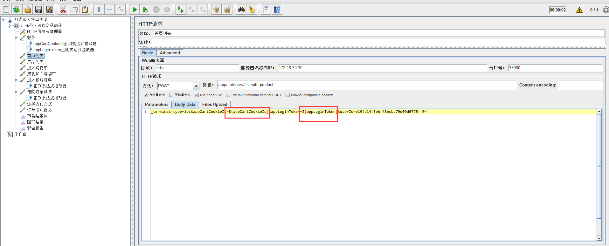

如果想在路径里面使用上一个请求产生的参数，body data或者parameters必须带上这个参数，哪怕请求body体用不上这个参数


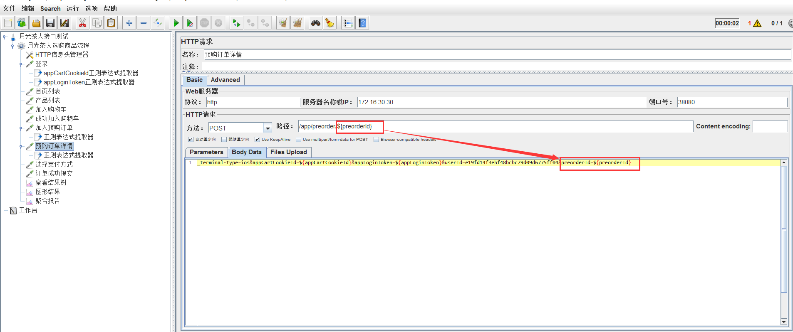

- 最后添加用于查看结果的“查看结果树”和“聚合报告”，在“查看结果树”里面可以详细看到响应的数据、请求数据、取样结果等信息


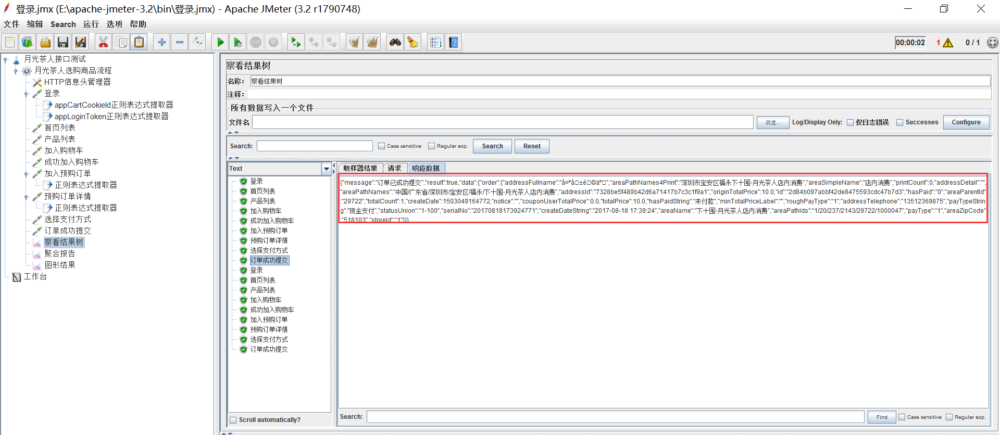


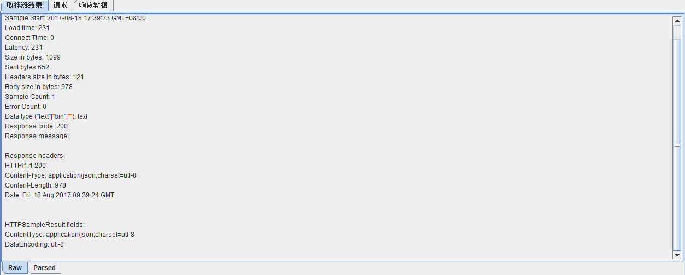


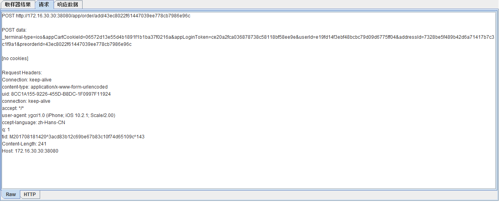


- 聚合报告汇总了接口访问总量错误信息等关键指标


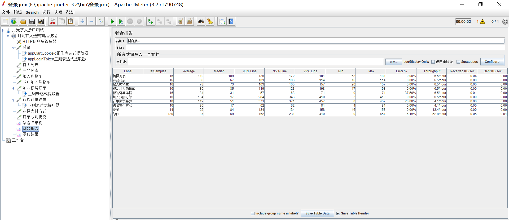

- 也可以把抓包获取的header添加到jmeter里面（模拟的更真实一些，表头一般是存储设备等信息的）


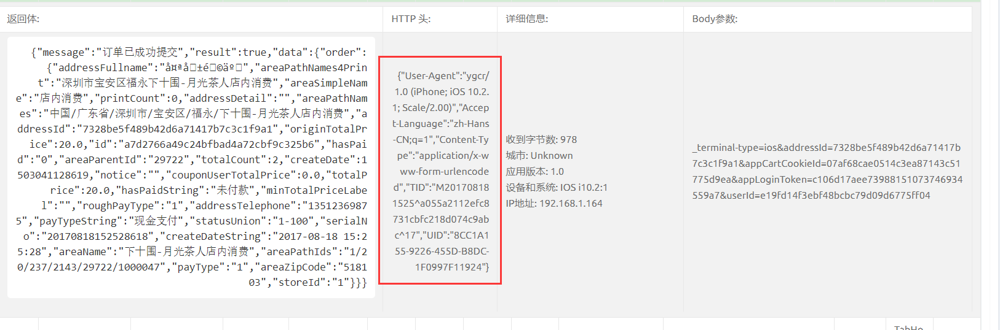


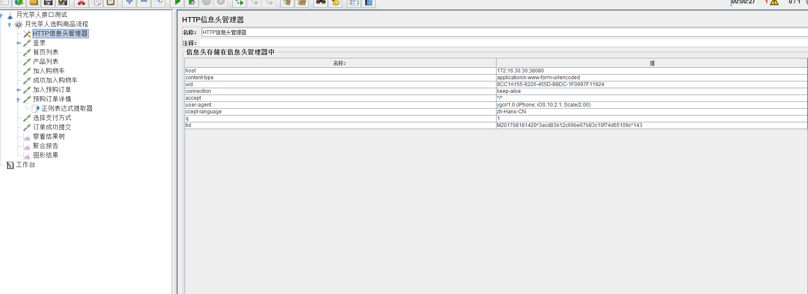

这样发送过来的请求,监控平台上设备就显示为iphone了


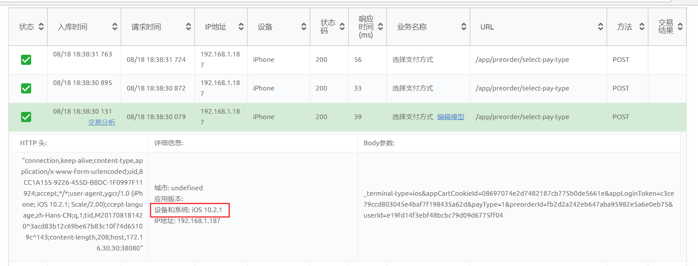

## 模拟登录月光茶人APP后选购支付流程大量并发的实现

  如果APP对登录有限制，同一账号只能同时登录一次，且手里没有多余的账号如何进行并发测试呢，这个时候只需单独对登录http请求进行控制即可；其他请求操作可以放在一块进行并发测试；

### 新建一个setUp Thread Group

​    使用这个进程组的好处时，他可以和tearDown Thread Group一起使用，构成一个 登录+中间各种操作/请求+退出的流程（单独使用setUp、tearDown也可以），登录请求放在setUp Thread Group,退出请求放在tearDown Thread Group里面，剩下的各种操作http请求放在线程组里面，我们此处没有用到退出操作就不需要新建tearDown Thread Group线程组了；

  如下图，在setUp Thread Group里面添加登录http请求后，我们需要获取appCartCookieId和  appLoginToken参数并且要全局化，下面其他进程中的http请求能继续使用；首先用正则表达式提取器提取相关参数，具体操作步骤前面有说过，不再赘述


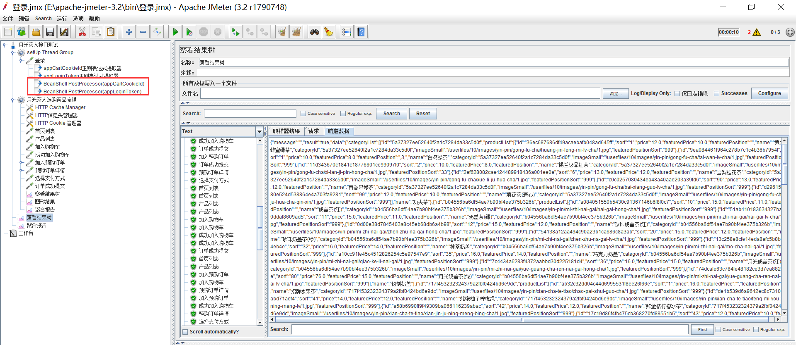


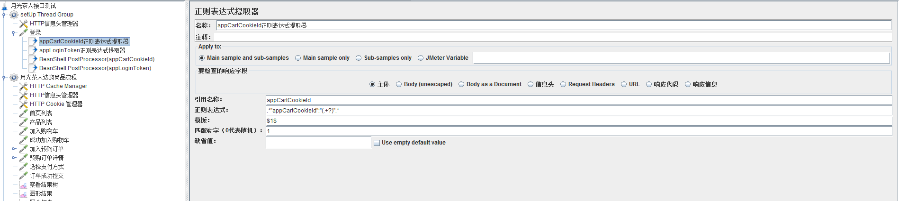

“(.+?)”.*  , (.+?)表示惰性匹配，表示从“开始，然后匹配到” 然后存起来；用\1 \2  或者$1 $2  取出第一个 第二个字符；

### 使用全局变量

  添加后置处理器BeanShell PostProcessor，把上一步正则表达式提取器提取参数全局化；如下图


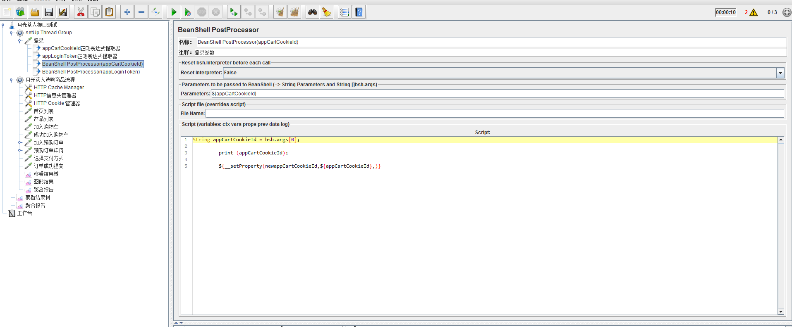

parameters参数填写正则表达式提取器提取的参数，然后在script模块进行全局化申明：

```java
String appCartCookieId = bsh.args[0];

 

​         print (appCartCookieId);

 

​         ${__setProperty(newappCartCookieId,${appCartCookieId},)}
```


### 引用全局化参数

在其他进程组里面，进行引用全局化参数，引用格式：${__P(newappCartCookieId,)}


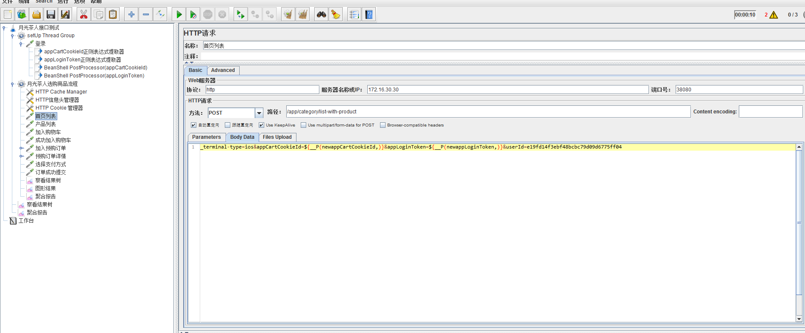

上图除了全局变量外，还引用了其他参数：

_terminal-type=ios&appCartCookieId=${__P(newappCartCookieId,)}&appLoginToken=${__P(newappLoginToken,)}&userId=e19fd14f3ebf48bcbc79d09d6775ff04；也可以写成parameters的形式，详细讲解可以参考：http://www.cnblogs.com/allen-zml/p/6552535.html


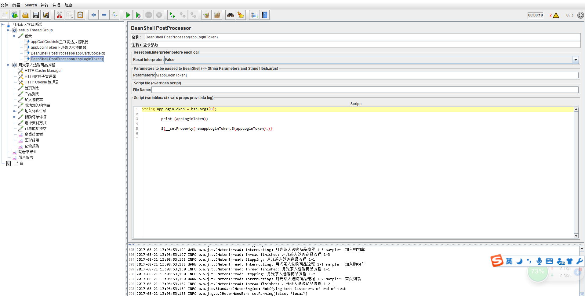

  可以在登录线程组里面添加http信息头管理，填写设备信息tid、uid等这样模拟出来的请求更接近iOS移动设备发出的请求；


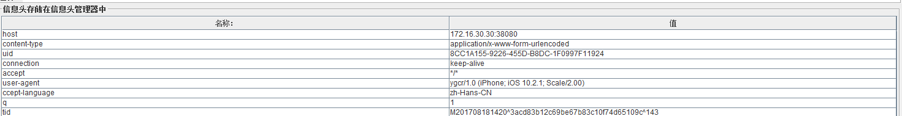

### 控制吞吐量


- 确定要添加控制吞吐量的位置后，添加-定时器-Constant Throughput Timer，然后填写如图相关信息


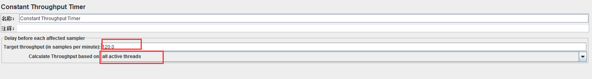

- 如果想控制每秒2个并发，红色区域1填写120即可，如果Constant Throughput Timer添加到所有线程组的前面，都要用到此控制器，下拉选择all  active  threads选项；如果放到某一进程组，只供此进程组使用，可以选择this thread  only；


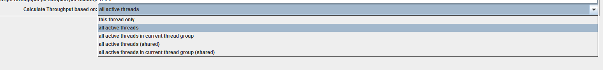

