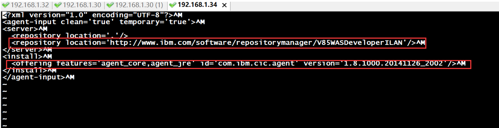
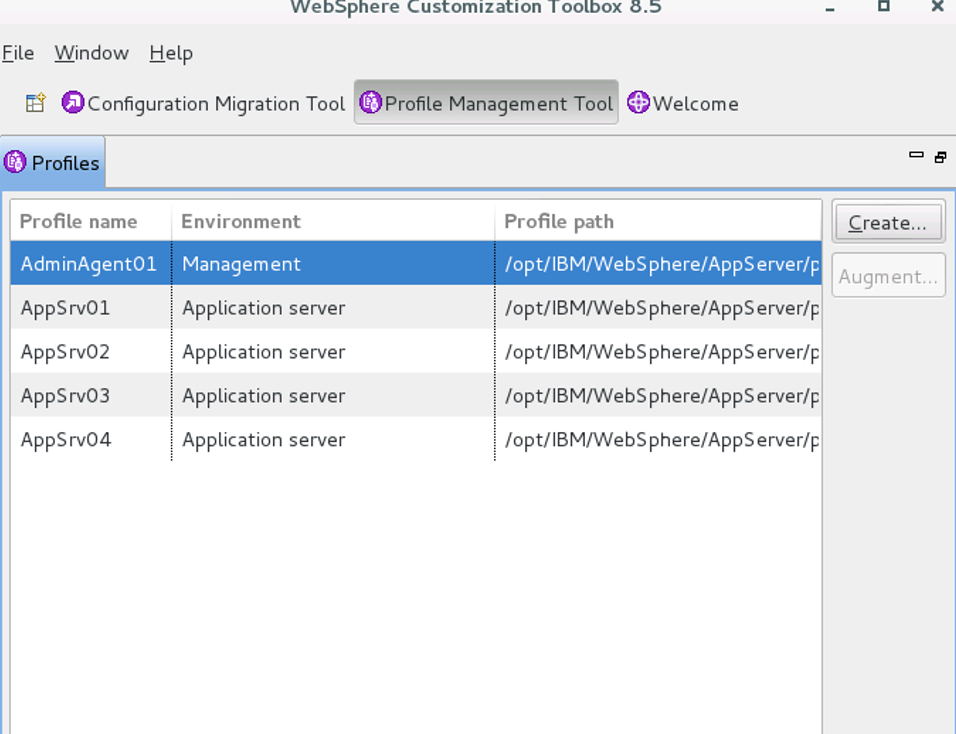
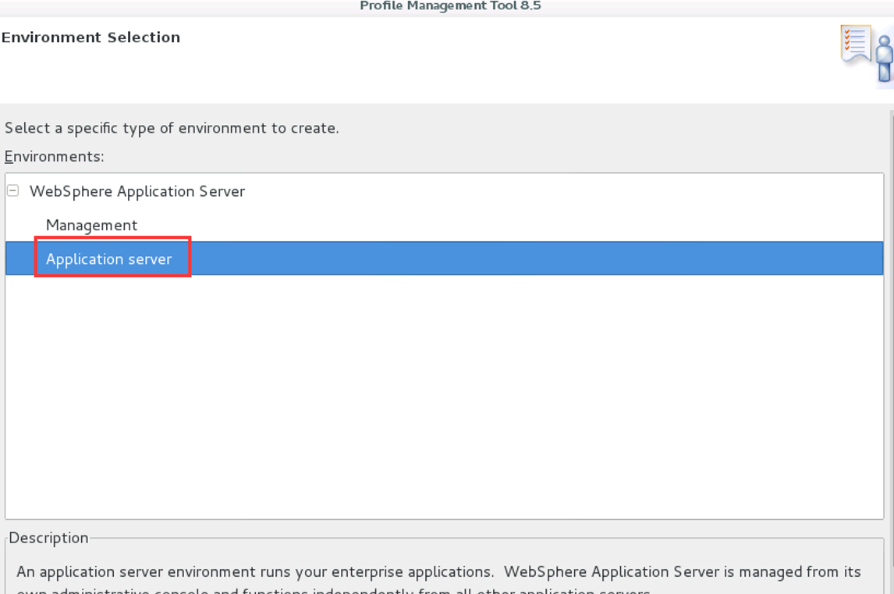
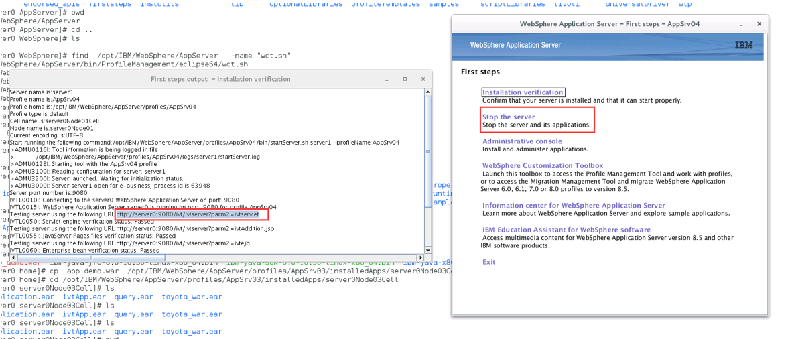
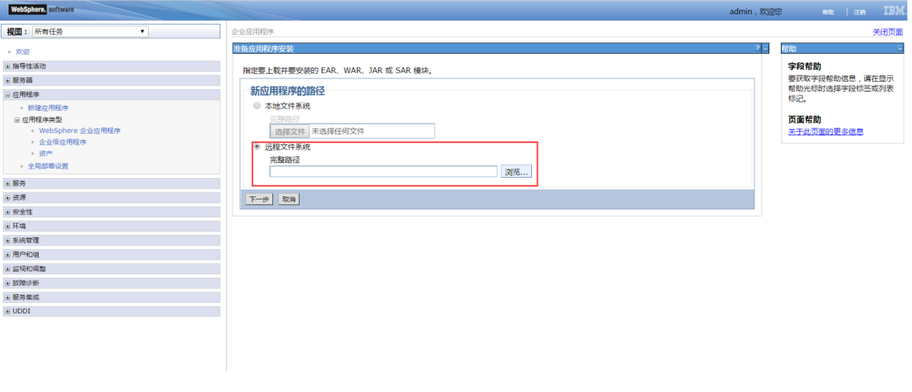
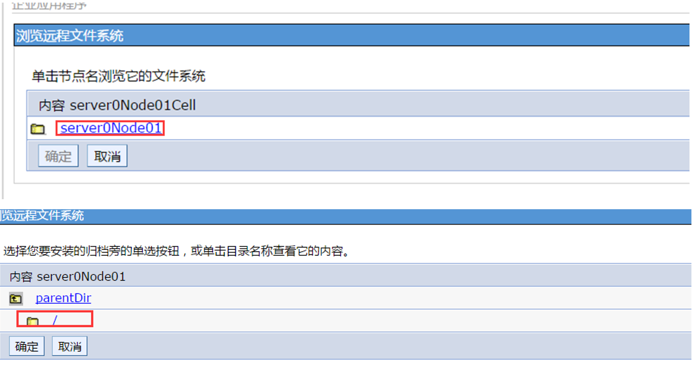
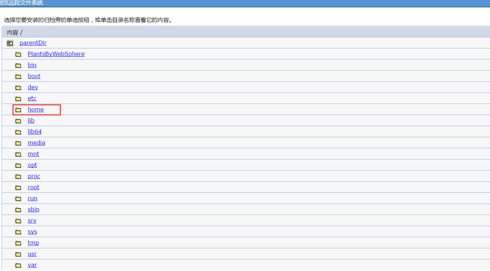
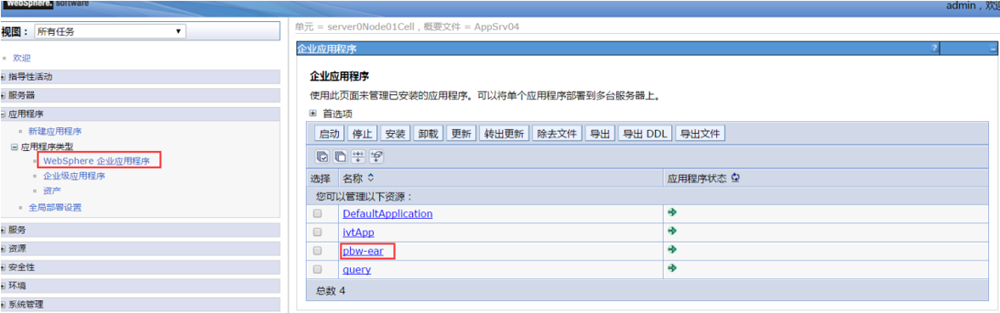

# was8.5在线安装和示例部署

- WebSphere8.5及以上版本，都是采用控制台安装

  ## 安装

解压从官网下载下来的文件后,要在有可视化界面的Linux进行操作；

执行`./install`

进行安装

只选择我们要安装的WebSphere 服务器，因为需要到IBM服务器下载，异常缓慢；如果我们安装时，异常缓慢或者服务器总掉线时，我们可以先停止安装，编辑install.xml文件；修改之前备份一份，如下图红色部分都可以删除，删除完成后；再执行install，这个时候只是安装了install manager并未安装WebSphere；我们再把原来的install.xml替换回来，执行./install 命令安装，勾选上我们需要安装的WebSphere服务和演示程序即可；

##  创建服务

安装完成后，在安装目录如：/opt/IBM/WebSphere/AppServer/bin/ProfileManagement/ 下，执行 ./wct.sh后出现下图面板，我们创建 Application server 类型服务器即可；

 

创建完成后，弹出first steps 窗口，我们再窗口里面点击 Installation verification，即可验证和启动程序，同时弹出日志小窗口，如果提示browser找不到，我们可以到环境变量文件/etc/profiles里面把火狐浏览器位置修正一下；

启动成功后，日志小窗口会提示访问服务器的URL结果，我们可以把里面连接粘贴到浏览器里面进行访问；

 

如果我们下次开启firststeps 可以到安装目录：WebSphere/AppServer/profiles/安装服务器的名称/ firststeps  里面执行`./ firststeps.sh` 来开启服务器

 

## 部署演示程序

 

### 安装数据库

进入演示程序目录：WebSphere/AppServer/samples/  后解压PlantsByWebSphere文件后会出现数据库文件，pbw-db.jar；我们通过命令 ：`jar -xvf pbw-db.jar`后把数据copy指定目录：`cp -r PLANTSDB /opt/IBM/WebSphere/AppServer/derby/databases/`

### 部署程序：

访问控制台：

<https://ip:9043/ibm/console/logon.jsp>   账号：admin，密码：123456；

在控制台中新建应用，路径选择远程，如下图，不断往上回溯，找到根目录，然后再进入搭配sample存放的目录，选择 [pbw-ear.ear](https://192.168.1.34:9043/ibm/console/browseRemoteNodes.do?csrfid=419262294&remoteFileName=%2FPlantsByWebSphere%2Fpbw-ear.ear) 文件，导入即可；

 

导入成功后，我们启动相应的应用即可，如果上下文根过长，可以修改；

测试应用地址：

http://192.168.1.34:9080/plants
