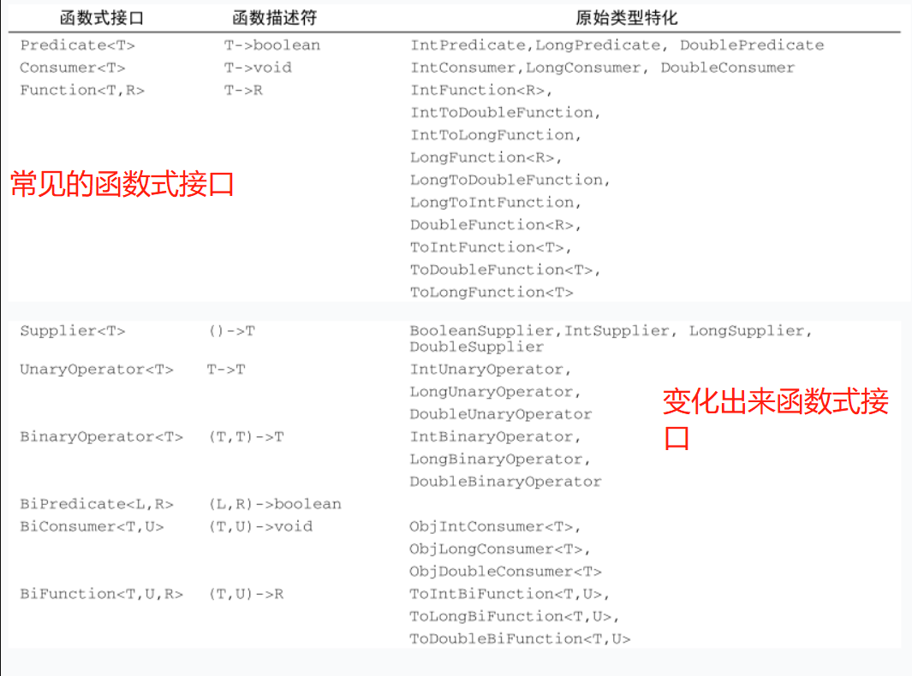

# jdk8新特性-Stream详解

jdk8与之前版本比较增加了几个重大的功能，这里重点说明Stream的原理、用法，也会简单罗列一些其他几个新增功能。

## 其它新增功能

### 新增功能1-日期时间处理类

之前java版本，对日期和时间处理比较繁琐 ，所以在jdk8中引入了LocalDate、LocalTime以及结合这两个类特点的LocalDateTime类。用法非常简单，从下面代码就可以一目了然的看明白其用法。

```java
package com.zhengling.work;

import java.time.*;

public class DateDemoForJdk8 {
    public static void main(String[] args) {
        LocalDateTime now = LocalDateTime.now();
        System.out.println(now);
        LocalDate today = LocalDate.now();
        System.out.println(today);
        System.out.println(LocalTime.now());
        int year = today.getYear();
        int month = today.getMonthValue();
        int date = today.getDayOfMonth();
        System.out.println(year+"年"+month+"月"+date+"日");
        int hour = LocalTime.now().getHour();
        int minute = LocalTime.now().getMinute();
        int second = LocalTime.now().getSecond();
        System.out.println("现在是 "+hour+"点"+minute+"分"+second+"秒");
    }

}
```

直接就能获取当前时间且不需格式化处理，具体用法可以官方文档或百度、这里简单说明一下，以后遇到时间处理可以考虑到这几个新增的类。

### 新增功能2-lamda表达式

- lamda表达式已经在博客 [接口与lamda表达式](middleware/java-interface-lamda.md)一章中介绍过，这里做一些补充。

  lamda表达式主要是面向过程的，面向过程的语言一大优点就是不需要对象、甚至方法、成员变量的类型，只需要编写执行步骤即可。

  如果接口中的方法没有参数，写作：()->{操作代码}；如果有一个参数，写作：x->{对x进行操作的代码}；两个参数，写作：（x,y）->{对x和y进行操作的代码};   操作代码只有一条，{}可以省略不写。

  如果只有一个参数，且只有一条代码操作，还可以继续简写。

  1. **引用对象的方法** 类::实例方法 

  2. **引用类方法** 类::类方法

  3. **引用特定对象的方法** 特定对象::实例方法

  4. **引用类的构造器** 类::new 

     具体用法可以参考博客：https://blog.csdn.net/chengqiuming/article/details/91354594

     在处理Stream流中，很多时候就用这种表达式，因为对流中的每一个元素操作可能就是一条代码；

     ```java
      List<Integer> list = new ArrayList<>();
     
     IntStream.range(1,11).forEach(list::add)
     ```

     像这种生成一个1-10一个集合，设置可以让流进行toArray 汇合成集合也行。还有一个最常用的`System.out::print` System.out是一个PrintStream类型的对象，然后调用实例print方法。::表示每一个对象。

     之所以补充这么多lamda知识是为先Stream做知识储备的。因为Stream里面很多操作，里面参数都是接口类型的、而且接口的抽象方法都没有实现；这样在处理流时，根据实际情况来灵活操作。这就是函数式（注解为@FunctionalInterface)接口优点, 方法在用的时候用lamda实现，比较灵活，怎么操作由使用情况来决定。正因为jdk8中引入了lamda表达式，Stream才变得容易，要不然操作方法里面接口 都要用匿名内部类来实现，代码就非常臃肿。所以Stream操作前提是lamda要学好；

## Stream详解

### 概述

  如何更生动形象的理解Stream呢？Stream可以看做一个管道中的流，比如说一个自来水厂，它从河流边铺了很多管道连接到厂里。第一节管道是过滤，把杂质过滤掉；第二节管道是添加氯气之类的净化试剂，第三节最终汇总到水池中。这一节节的管道就可以看做成Stream处理方法，Stream中转换流是惰性的，就像这些管道一样它们平时不工作，只有池子需要抽满水时，这几节管子（stream处理方法）才会有水流过。而且源头可能是无限的，也可能是有限的，但最终给池子中的水是有限的。

  像上面说的，第一节第二节管子是转换用的，转换出来后仍然水流，第三节管子是最终出口，流出来的水汇总到池子后，就无法再流向他出了。Stream中这种转换用的管道叫“Intermediate”操作，最后一节管道是“Terminal”操作。 怎么判断某一步的操作属于“Intermediate”还是“Terminal”;其实很简单，查看jdk8-api的Stream，只要方法返回值是Stream（IntStream、DoubleStream也是一种Stream）就是转换流（Intermediate）操作，只要返回值是其他的（不管返回的是void 还是boolean或者其他类型）都是“Terminal”操作。 还有一种简单方法，在IDE(eclipse或idea)方法点后会自动提示后面方法，里面返回值是Stream的就属于“Intermediate”操作。

  常用的filter、map、limit、flatMap等就是Intermediate操作，forEach、toArray是“Terminal”操作。具体用法下面会结合代码来说明。

  除Stream外还有IntStream、DoubleStream、LongStream，之所以不用Stream<Integer> 这种形式，是这种类型的stream 在开/装箱时会增加额外的内存消耗。

### Stream的生成

  Stream流的生成有很多种方式，这里就说下使用频率较高的几种做一下说明。

  - 1.collection类型的对象，直接可以通过实例.stream/parallelStream把集合转换成流/并行流；Map虽没有流转换方法，但可以先把Map（如values方法）转成Collection，再转成流。

  - 2.直接静态of方法创造Stream stream = Stream.of("a", "b", "c");

  - 3.数组转换，其实也是静态方法，把of方法里面参数换成数组即可。

  - 4.各种nio、io方法操作后出现的流  ,如Files.walk/find等，还有其他类，这里不一一列举了；

  - 其他方法

    - 自己构建
      - java.util.Spliterator   分离器
      - 构造器  builder
    - 非自己构造

       *   Random.ints()
        *   BitSet.stream()
        *   Pattern.splitAsStream(java.lang.CharSequence)
        *   JarFile.stream()

  ### Stream的操作

  - filter的使用 ：filter所属的类型 是有一个接口，有个抽象的 boolean返回类型的 test方法，用它过滤非常好，它也是一个转换流：

  ```java
  int[] positive = IntStream.of(myarr).filter(x->x>0).toArray();
  ```

  过滤掉数组中小于0的数值，形成新的数组。

  - map使用，map表示一对一的关系，流中的每一个元素都会按照规则生成一个对应的新元素

  ```java
  zheint[] positive = IntStream.of(myarr).map(x->x*X).toArray();
  ```

  会生成一个新数组，数组中每个元素是源数组每一个数值的平方。mapToInt/mapToDouble/mapToLong用法和map差不多，区别是这几个映射出来的元素是int、double、Long类型的，具体映射关系，直接lamda。

  - flatMap的使用

  ```java
  List<String> words = br.lines().
  flatMap(line -> Stream.of(line.split(" "))).
  filter(word -> word.length() > 0)其他后续操作
  ```

  flatMap是一对多的关系，上面代码是把每行文字再转换成流，最终形成新的流，里面都是字符了。如果一个二维数组转成流，然后再把流中每个元素再转换成流，这样最终会形成 一个流、流中的每一个元素都不在是数组了，是一个单一的对象（值）。flatMapToInt等映射和flatMap类似，就像上面的mapToInt映射出来的元素是int类型。

  - concat是把两个流拼接成一个流

  - peek 对每个元素执行操作并返回一个新的 Stream

    ```java
    String[] strs = {"a1","b2","c3"};
    Object[] objs = Stream.of(strs).peek(x-> System.out.println("dddd"+x)).toArray();
    System.out.println(Arrays.toString(objs));
    ```

    输出的内容是：

    ```java
    dddda1
    ddddb2
    ddddc3
    [a1, b2, c3]
    ```

    - limit/skip ：（limit 返回 Stream 的前面 n 个元素；skip 则是扔掉前 n 个元素 ）最终形成的流；Sorted是对流进行排序，要在Sorted中实现（comparator接口中）ComparaTo方法；distinct和filter有点类似，distinct是对流去重操作。

      **以上方法基本是用来对流中转操作的，即属于Intermediate操作**

      - sum（IntStream等流中）min、max、count等都是最后操作，求和、最小值、最大值、元素个数、平均值等。

      - toArray最终流汇总成一个数组；

      - forEach和forEachOrder 对流中每一个元素进行的操作，区别在于后者会保持流中每个元素位置不变。

      - collect 把流汇入到一个容器中（水汇入到一个池子中），然后可以在这个容器中，进行一些操作；如把所有元素进行拼接等。

      - 还有各种xxxMatch和findXxx的方法，前面是进行元素匹配，具体怎么匹配，用lamda写一个布尔表达式就行了，findXxx返回的是一个Optional类型的数据，这个类型是jdk8增加，具体用法可以看官方文档，这个类用法今后也会越来越多。

        **这些方法都属于Terminal操作，用它们处理后，流就停止了，不会有流往下输出了。**

### Stream方法中接口知识补充

- Stream中很多方法中都是接口参数，主要是Predicate、Supplier 、Consumer 、Function这四个以及它们更多的变种，一般名称规则是xxxPredicate、xxxSupplier、xxxConsumer 、xxxFunction(Operator和它的变种xxxOperator也属于Function变种）、如果是Bixxxx+前面四个基本接口参数，表示此抽象方法需要两个参数；

它们作用如下表格：

| 函数式接口    | 函数描述   | 作用                      |
| :------------ | ---------- | ------------------------- |
| Predicate<T>  | T->boolean | 输入泛型T,返回Boolean类型 |
| Consumer<T>   | T->void    | 输入泛型T，没有返回值     |
| Supplier<T>   | ()->T      | 什么都不输入，返回T       |
| Function<T,R> | T->R       | 输入T，返回不同类型的R    |
|               |            |                           |

-   从表格结合单词意义就很容易理解这些函数式接口了，Consumer 消费者，让T消耗掉后，然后返回void（就是没有返回值）、Function就是数学中常用的函数：y=f(x)，输入x，返回y。Supplier提供者，什么参数都不需要 返回一个T ,Predicate意为谓语、阐明、断言等，就是返回boolean类型的抽象方法。



- 这种思维和方式，可以供开发借鉴到以后的代码中，比如定义一个借口，里面的各种抽象方法、其参数类型是这些函数式接口，并形成一种规范，编程人员在代码实现时，只需要根据生产情况，用lamda把这些抽象实现了即可。做到简洁高效的开发。

  

