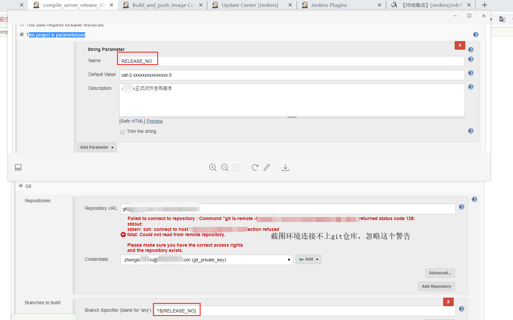
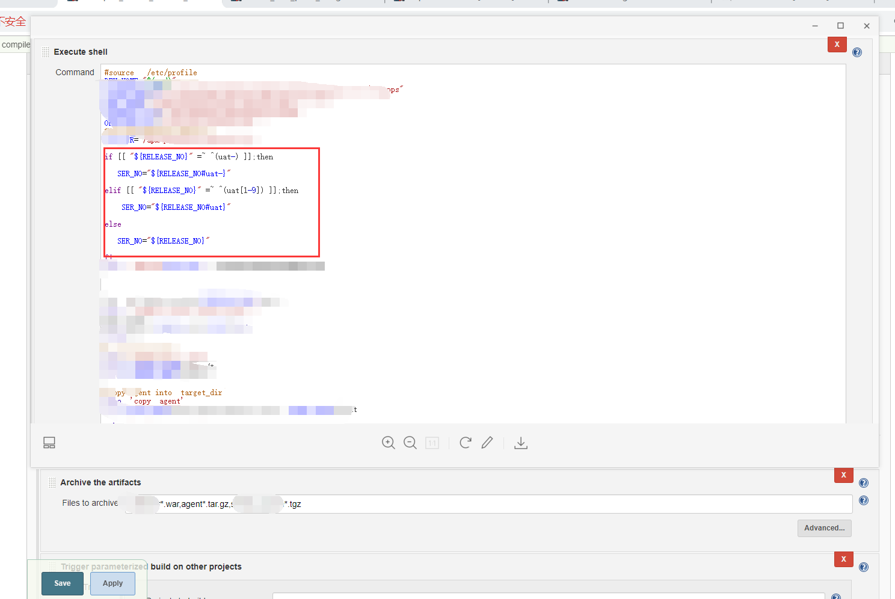
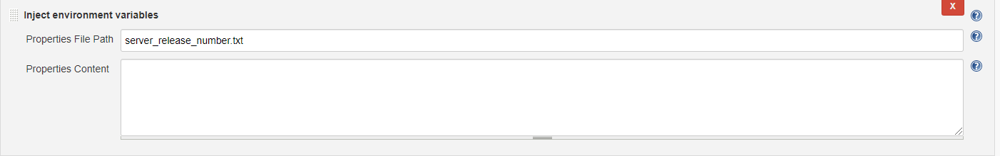
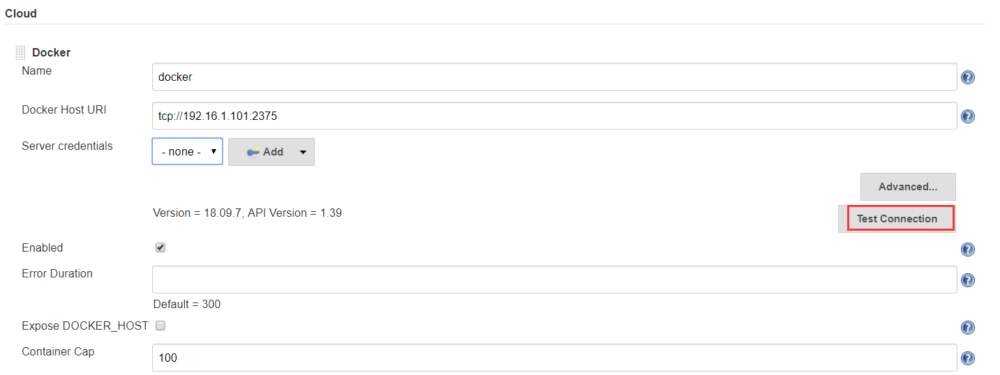
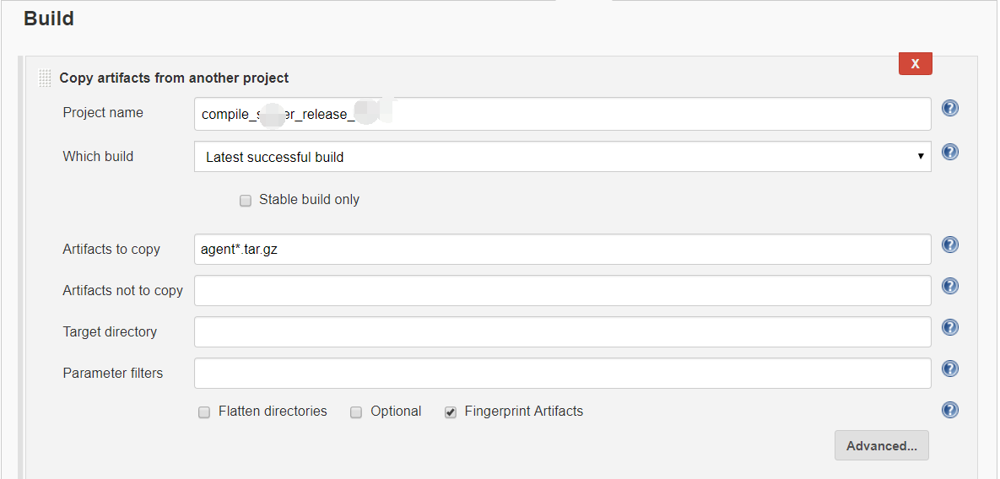
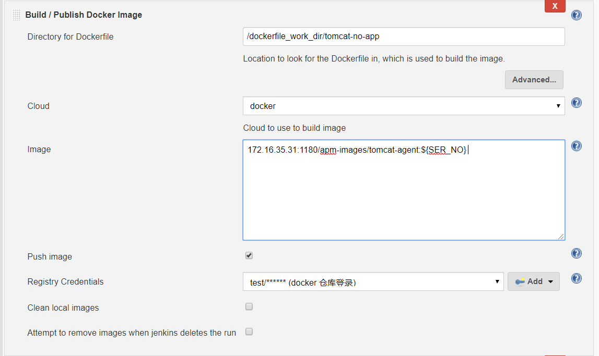

# 利用jenkins+harbor+k8s搭建起一套实时更新测试环境

## 场景描述

**有这么一场景，Java被测应用和Java探针一起制作成镜像后部署到k8s环境，当有新版探针发布时，要基于新版探针制作一个新的镜像，并在k8s集群中更换镜像。**

- 分析需求后，决定用两个jenkins   job来完成这个任务。

1. 第一个job，把原来编译打包探针job中增加触发下游项目和传递探针版本参数功能。

2. 第二个job，由第一个job触发；1，copy第一个脚本编译出来的探针文件，然后利用docker插件把最新探针文件连同被测应用镜像合成出 我们需要的镜像；2，推送到harbor仓库；3，最后在k8s集群更新镜像。


## 实现步骤

### job1的实现

-  插件准备："Environment Injector "  "Copy Artifact"   "Parameterized Trigger "  一些基础的插件这里不再说了；
-  原有job功能说明

​      我们探针源码有多个分支，有开发用的dev、测试用的test，以及正式版本uat-x.x.x(x为数字)；关于正式版呢，在测试通过后，会基于test分支创建出一个uat-x.x.x的正式版。这个时候人为构建job时，输入正式分支版本号，即可下拉这个版本源码，进行编译、和打包存档操作。

project 部分截图

拉取指定分支源码



编译和存档，编译在execute shell模块实现编译，并对版本参数处理，去掉uat-,只保留数值。



增加的两步

1，在execute  shell中 把截取后版本号保存到一个文件中

`echo  "SER_NO=${SER_NO}" > server_release_number.txt`

然后注入到环境变量



2，触发下游项目并传递参数

增加构建后操作"trigger parameterized build on other projects",里面增加"Predefined parameters"


### 构建工程2的实现

额外所需插件 Docker，建议提前把所有用到插件罗列好，然后再进行安装，这样安装完成后重启jenkins一次就行了。

docker配置：

- 1，首先把用来制作镜像的节点机  增加调用的接口2375；

  具体配置可以参考我的另一篇博客[jenkins调用docker编译程序](../jenkins/jenkins-slave-for-docker.md)

- 2，jenkins配置cloud中增加docker

  

  

3，也增加构建参数，便于再没有接收到来自job1传递过来的参数时，可以手动输入


4，copy上游构建编译出来的探针



这里先不指定copy目标目录

5，增加copy探针和判断这个版本镜像是否已经存在（很可能出现2.3.5版本有重大问题，开发向2.3.5版本合入修改bug代码）

- execute  shell

  ```
  AGENT_DIR="/dockerfile_work_dir/tomcat-no-app"
  rm -rf  $AGENT_DIR/*.tar.gz
  cp -r  $WORKSPACE/*.tar.gz  $AGENT_DIR
  IMAGES_NU="$(docker image ls 172.16.35.31:1180/apm-images/tomcat-agent:${SER_NO} | wc -l)"
  echo $IMAGES_NU
  if [[ $IMAGES_NU -ge 2 ]];then
     kubectl delete deployment test-toyota-demo -n test-shop
     docker rmi 172.16.35.31:1180/apm-images/tomcat-agent:${SER_NO} 
  fi   
  ```

  删除制作镜像路径下的探针压缩包，把最新的copy过去；然后判断是否已有这个tag的镜像，有就删除应用后，再删除镜像；这个场景重点测试的是探针，所以不用关心应用的高可用、滚动更新、灰度发布等问题；如果重点是应用的测试，一定要保证应用的可用性；这一步的execute shell ，就不需要了，直接进入下一步。

  6，镜像生成和推送

  

  填写好dockerfile的目录，cloud选择之前配置的就行，image名称，仓库证书（里面有仓库用户名和密码）就可以把生成镜像推送到仓库了；

  7，最关键的一步更换k8s集群中应用的镜像版本；

  execute  shell 代码：

  ```bash
  AGENT_DIR="/dockerfile_work_dir/tomcat-no-app"
  IMAGE_NAME="172.16.35.31:1180/apm-images/tomcat-agent:${SER_NO}"
  kubectl get deployment/test-toyota-demo -n test-shop --export -o  yaml  > ${AGENT_DIR}/test-toyota.yaml
  kubectl get deployment/test-toyota-demo -n test-shop --export -o  yaml  > ${AGENT_DIR}/test-toyota-${date +%F%H%M%S}.bak
  kubectl delete deployment test-toyota-demo -n test-shop
  sed -ri "s#image: .*#image: ${IMAGE_NAME}#" $AGENT_DIR/test-toyota.yaml
  kubectl  apply -f  $AGENT_DIR/test-toyota.yaml
  ```

  要测试最新探针，这里强制性把之前被测应用都删除了，如果换成应用的测试，这里脚本可以稍作调整

  除了第一个execute shell 不需要外，此地execute shell 可以调整为：

  ```bash
  AGENT_DIR="/dockerfile_work_dir/tomcat-no-app"
  IMAGE_NAME="172.16.35.31:1180/apm-images/tomcat-agent:${SER_NO}"
  kubectl get deployment/test-toyota-demo -n test-shop --export -o  yaml  > ${AGENT_DIR}/test-toyota-${date +%F%H%M%S}.bak
  kubectl set image deployment/test-toyota-demo   test-toyota-demo=${IMAGE_NAME}  -n  test-shop
  ```

  就可以了

- 强调一点，部署应用时，一定要设置镜像拉取规则为总是拉取。


