# Vcenter中利用模板快速部署centos虚拟机：

## 1，登录vcenter

<https://ip:port  输入账号，密码；进入后选择HTML5格式的

## 2，找到centos虚机模板

找到之前已经制作好的centos7.5模板

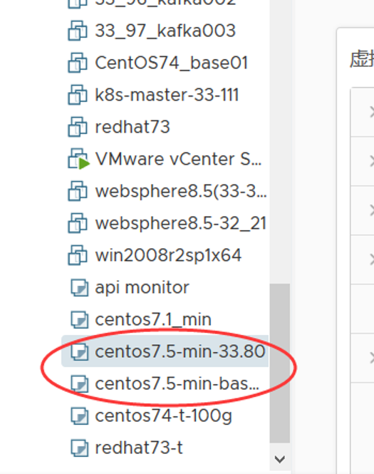


## 3，创建虚拟机

选择从此模板新建虚拟机


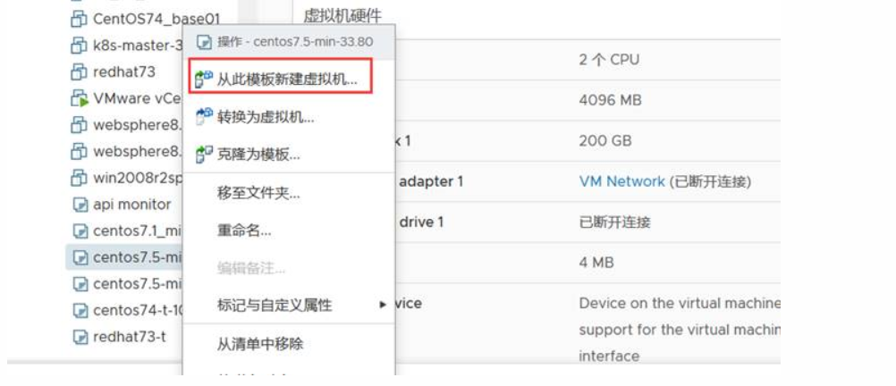

## 4，命名和选择合适的位置

- 给新的虚机命名


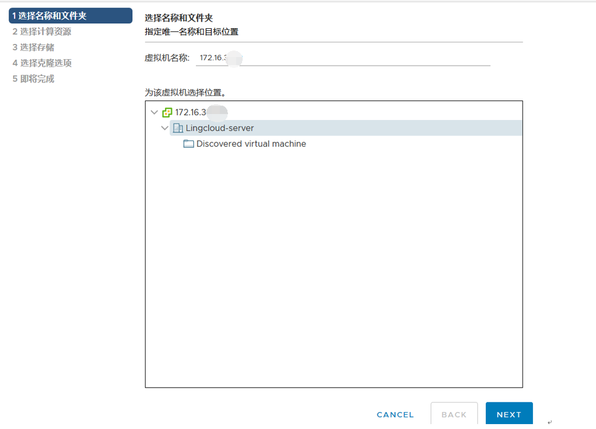

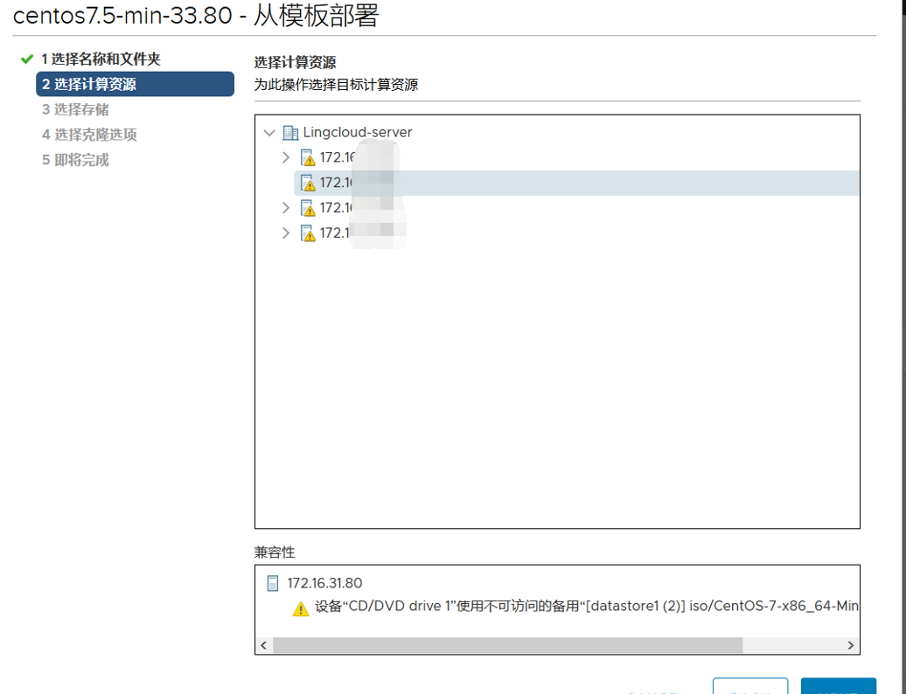

这里面vcenter管理了4台esxi 系统服务器；选择要部署到那台服务器上。

## 5，找到新建虚机修改配置:

- 查看部署 进度

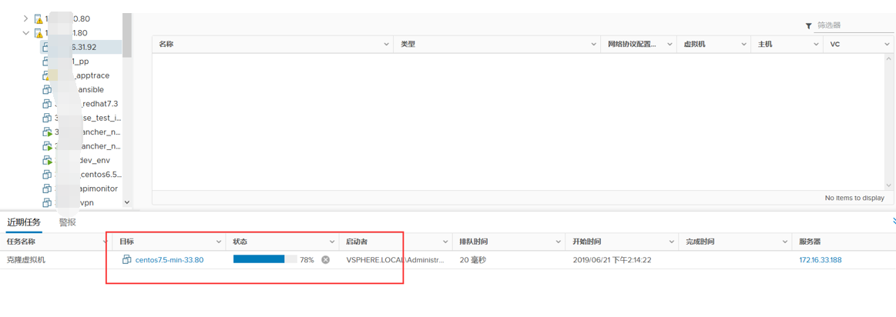

待完成后 要修正此虚机默认配置

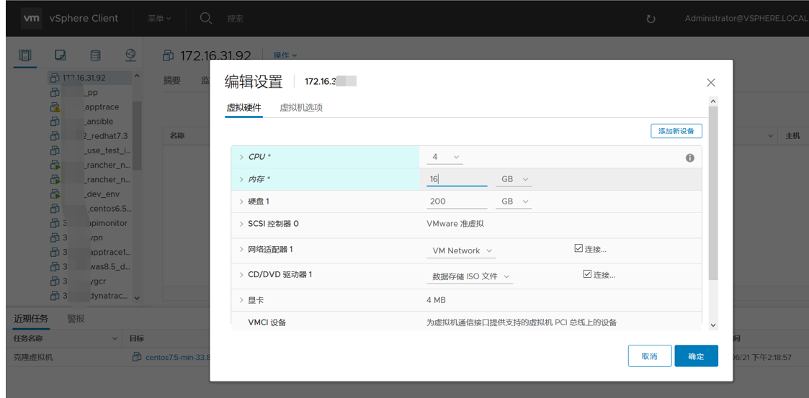

## 6，开机固定ip hostname等

如果电脑装有VMware Workstation  直接选择 remote console

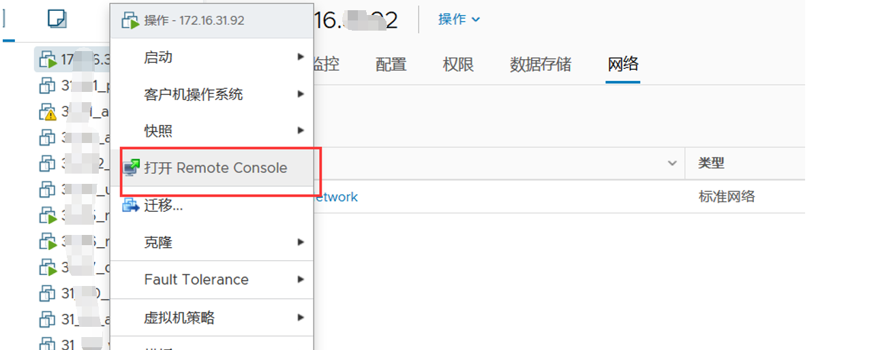

如果没有装 可以用登录这台虚机所属的esxi（vmmare服务器）如：<https://esxi>

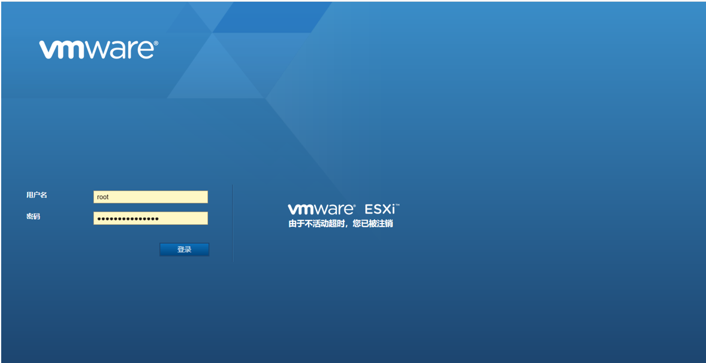

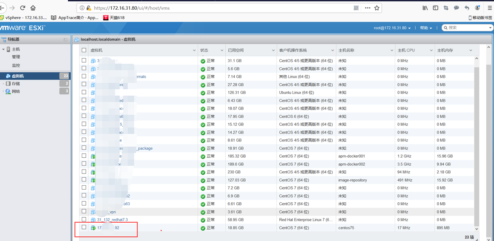


打开浏览器控制台

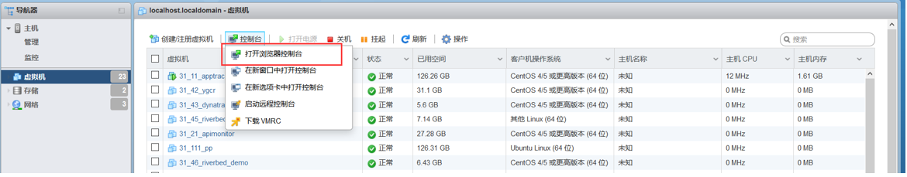

不管是通过浏览器还是VMware Workstation  能进入到虚机就行

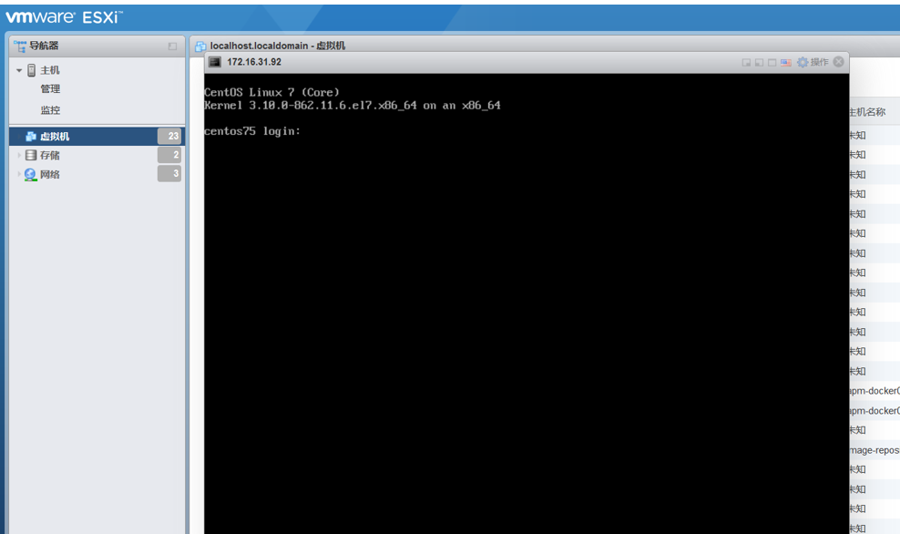

输入密码和账号（制作模板时设定的密码）

先ip a  查看一下 自动获取的ip  或者之前的ip

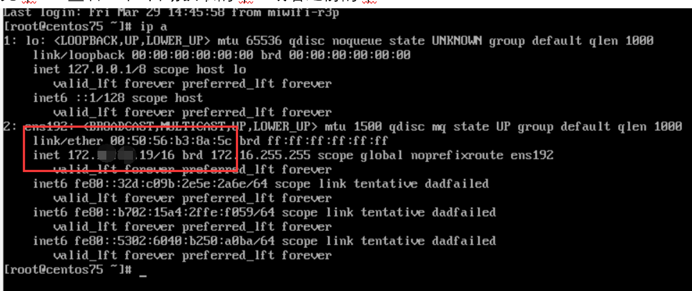

输入nmtui  进行修改ip

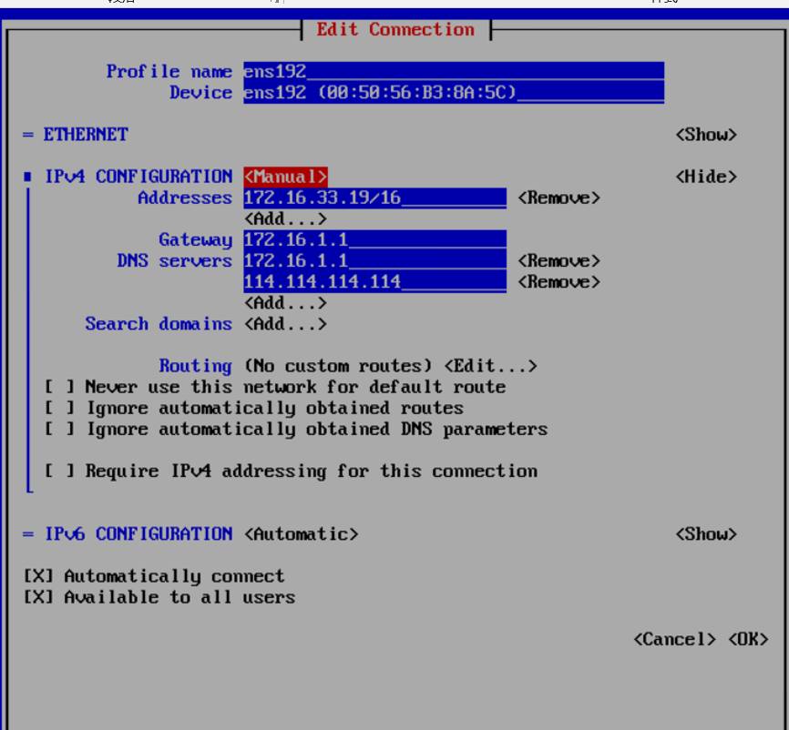

修改完成输入 systemctl  restart  network  重启网卡

检查一下

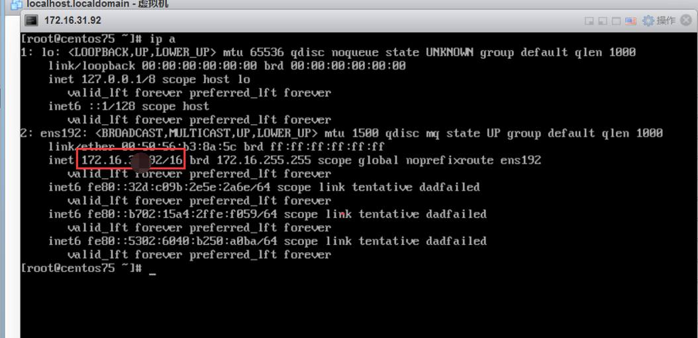

修改成功

Hostname 也可以修改一下 

```
Hostnamectl  set-hostname app002

Bash
```

然后就可以看到新的hostname了  

 

## 7，跳板机登录服务器

在跳板机中（或ssh） 输入服务器账号密码信息后

可以正常登录，然后进行剩下的操作。