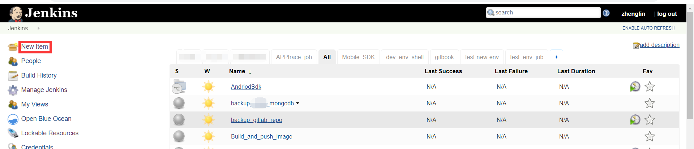
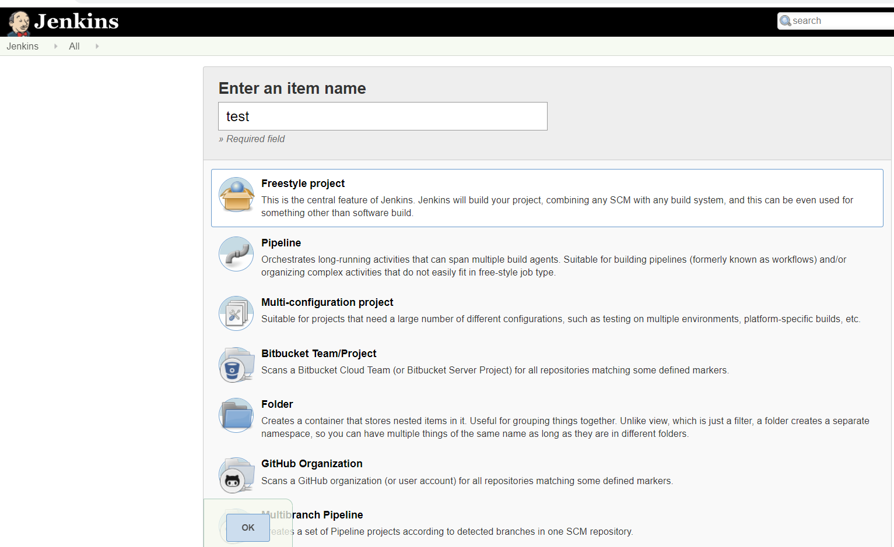
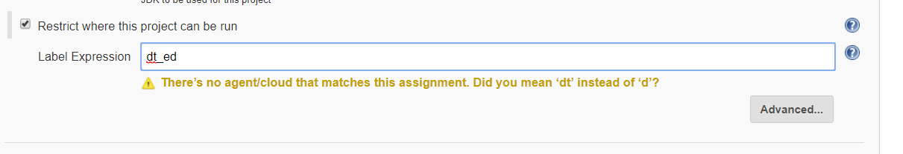
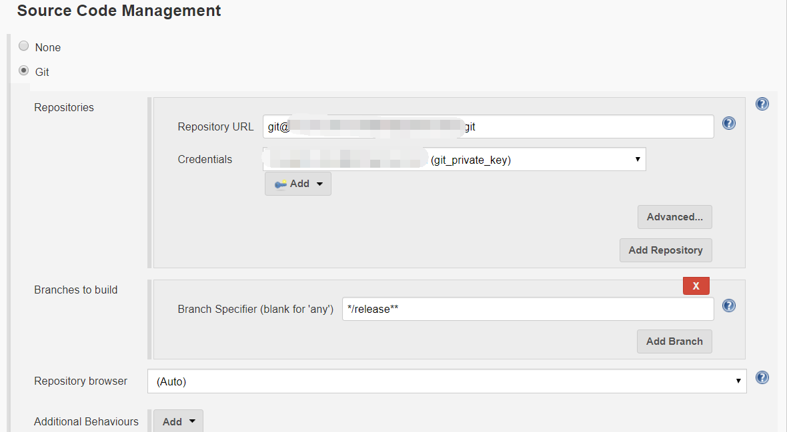
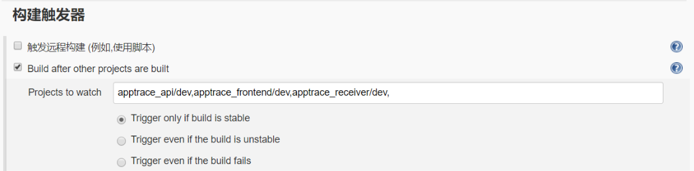
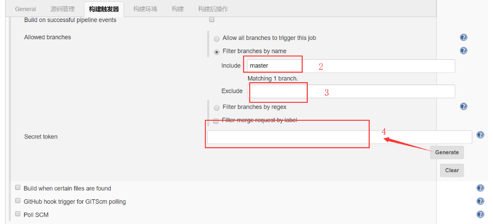
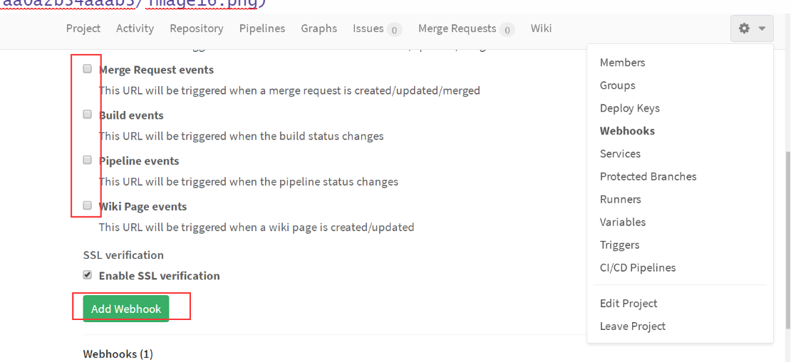
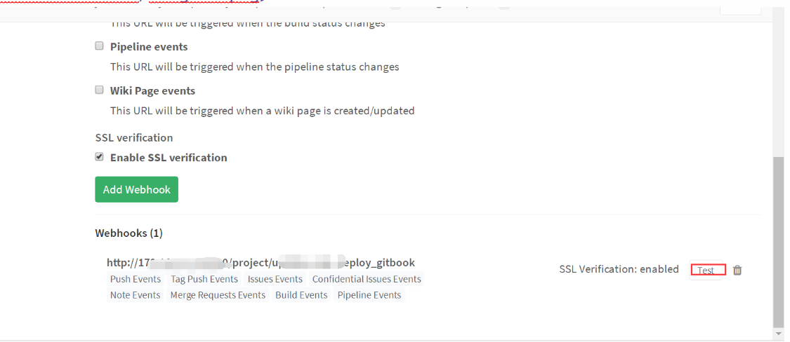
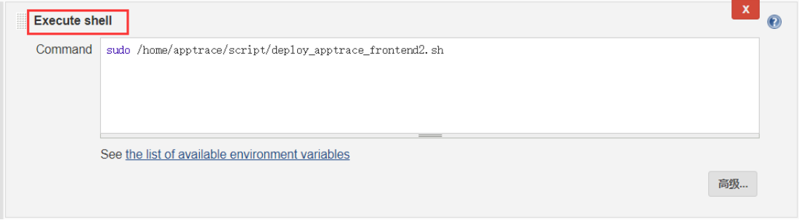
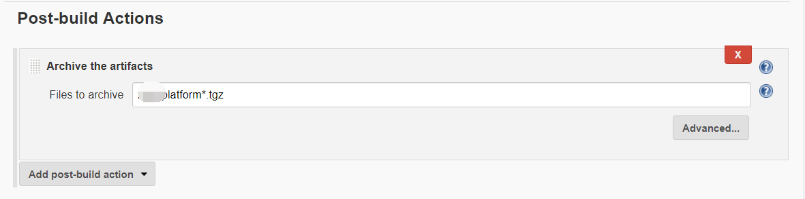

# 新建一个自由风格的job

  自由风格的job，最容易上手，一般项目初期或者小型团队和不是特别复杂工程，都可以选择这种风格job进行编译构建。

## 创建

- 点击左上角New Item(中文语言环境下是“新建”)

- 填写名称，选择构建什么类型项目，这里选择自由风格的

## job配置

- 然后点击ok，进入job编辑界面，可以简单填写一下描述信息

- 可以参数化 构建，如选string Parameter ,这个参数设置一个默认值，每次构建时 都可以修改这个值；这个值也可以由上游job传递过来。

- 选择构建保留天数和次数

- 节点选择 ，选择合适节点构建job（默认是master节点）

选择节点是通过label表达式，所以新增salve机器时  加上标签，如果没有标签则默认为节点机名称

- 如果需要进行源码管理，根据实际情况选择源码管理工具，如git(svn 都支持)

理论上一个job最好只编译一个git仓库代码，如果想获取多个仓储代码，可以添加Multiple SCMs插件；

然后可以设置 拉取多个仓库源的代码，并设置检出到一个子路径。  

- 设定正确的触发器；

**Build after other projects are built：**

这种触发方式也非常实用，如果a程序是用来编译和打包的，b程序是用来更新的；b程序里面就可以用这种方式来触发，然后projects填写a就行，如果是pipeline项目填写到具体分支；

**Build periodically：**

选择build  periodically，然后按照规则进行设定，设定规则如下：

第一个参数代表的是分钟 minute，取值 0~59；

第二个参数代表的是小时 hour，取值 0~23；

第三个参数代表的是天 day，取值 1~31；

第四个参数代表的是月 month，取值 1~12；

最后一个参数代表的是星期 week，取值 0~7，0 和 7 都是表示星期天。

所以 0 * * * * 表示的就是每个小时的第 0 分钟执行一次构建。

例子如下： 

H 17 * * * 

17点

表示17点进行执行构建任务

H 8,12,15,16 * * 0-6 

一天的8点，12点，15点，16点， 每个星期的七天都是如此

如果设成间隔时间，写成  */5  这种格式

**Poll SCM：**

定时检查源码变更，如果有更新就checkout最新code下来，然后执行构建动作。里面为空就行了；也可以设置为定时任务。

**Build when a change is pushed to GitLab：**

  如果想设定gitlab仓库上master分支一有提交或者合并就触发构建，我们就可以勾选Build when a change is pushed to GitLab，使用它来实现这个功能（前提是jenkins已经安装gitlab hook插件）；

如果勾选了Filter branches by name，就针对某些分支才能触发，如图圈中2，填写包含的分支，多个分支用，隔开；图中3填写排除的分支；

点击4下面的Generate，生成Secret token码；然后进入gitlab的webhooks界面；把上面图中圈中1的地方url填写到下面图中圈中1地方；生成Secret token copy到下图中4的地方；

并勾选上需要的触发条件，配置完成后，点击add webhook ,即可；我们可以通过点击右下角的test按钮进行测试；

若点击test时，出现jenkins gitlab webhook 403 anonymous is missing the Job/Build permission提示，可通过“系统管理 -> 系统设置 -> 去掉 Enable authentication for ‘/project’ end-point” 来解决；

## 执行构建脚本

- 构建

注：点击“See the list of available environment variables”蓝色链接字体，可以查看到jenkins自带一些参数及用法示例；

也可以把脚本直接写入到此输入框中，这种模式下Jenkins任务执行完成后，会杀掉脚本里面所有新增进程。这是Jenkins自身机制问题，如何避免，见持续集成实战篇博客。

脚本里面有些参数，如ATRACE_HOME=aaa可以直接在节点里面配置，选择对应node——node Properties——Environment variables中 key:ATRACE_HOME  value:aaa  像java_home、git、mvn 节点机上没有写到环境变量的参数，这个地方都可以进行配置。

## 存档和构建后操作

如果构建完成后，会产出压缩包，我们可以把压缩包存放到当前构建目录，进行存档；

如果构建完成后，把压缩包，或者其他东西copy 指定节点机上，都可以在构建后操作中配置。

## 其他细节

如果嫌构建后自动形成的名称不符合自己要求，可重命名。 也可以安装插件，让构建后名称按照指定格式显示。