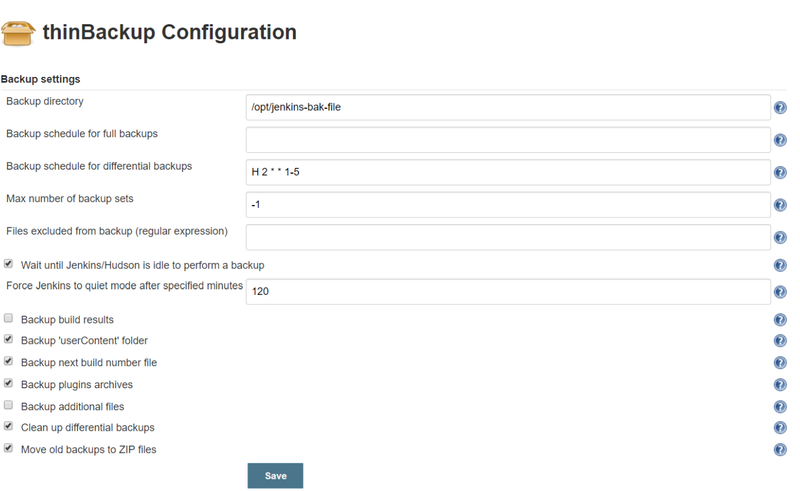
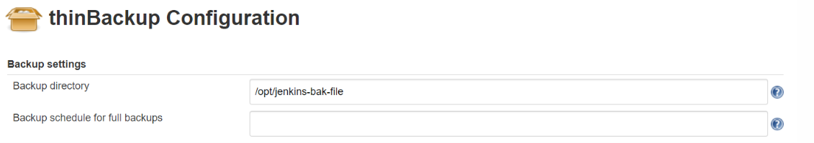

# Jenkins 配置和job的备份

## 关于jenkins中的备份可以借助插件：thinBackup来实现；

备份插件一般有 [Backup+Plugin](https://wiki.jenkins.io/display/JENKINS/Backup+Plugin)  [PeriodicBackup+Plugin](https://wiki.jenkins.io/display/JENKINS/PeriodicBackup+Plugin)  [thinBackup](https://wiki.jenkins.io/display/JENKINS/thinBackup)

### 备份

- 如果只备份配置和job， 选用thinBackup(也是最可靠的)，安装插件thinBackup后 就可以设定备份




我们再通过脚本 把备份同步到其他机器

\#!/bin/bash

rsync  -avz  /opt/jenkins-bak-file   root@ip:/opt  

然后把这个脚本 加到定时任务中

0 3 * * * /bin/bash /opt/backup-jenkins-config.sh &>/dev/null 

### 还原备份

把备份相关目录填写好



然后选择要还原的备份，选择全量包的哪一个 ，如果第一个备份是全量包，剩下的都是增量包，先还原全量包，还原成功后再进行增量备份还原，也可以在备份时，设置每天都全量备份，这样便于还原，一定要重启Jenkins，这样就可以看到还原的后的效果了.重启Jenkins若没有生效，在插件里面新安装任意插件或者更新任意插件，勾选上"Restart Jenkins when installation is complete and no jobs are running"  采用这种方式来重启Jenkins，这样就能解决还原不生效的问题。一般备份包(文件夹）都有严格的格式：

```
FULL-2019-07-12_15-53

DIFF-2019-07-12_15-53
```

