# rancher中快速部署应用

阅读前提：有docker知识储备，并对kubernetes有一定的了解

## 通过UI 部署应用

rancher在命名空间又抽象出一层，项目的概念（这个只是便于管理rancher抽象出来的，kubernetes中并没有这层）；我们可以先创建一个项目，然后在里面创建命名空间；这里为方便演示直接使用默认default的项目和default命名空间。

### 工作负载（deployment  daemon-set statefulset job等）部署

#### 1，在workloads tab中点击deploy

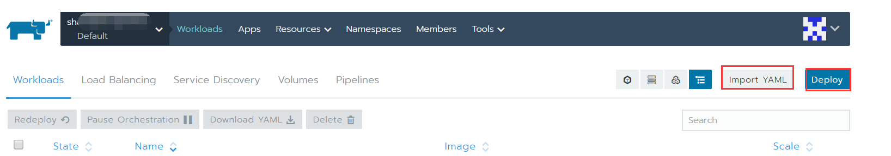

#### 2，填写配置信息

填写镜像名称，副本数量、选择负载类型等关键信息

#### 3，端口映射

#### 4，环境变量

除了可以使用自定义环境变量外，还可以使用内部的资源环境变量，如resource和field  

#### 5，调度规则

可以指定调度到（或不到）某个节点

也可以自定义匹配规则 

如图中设置 调度只匹配amd64位的节点

在节点调度模块点击show advanced options后，还可以设置容忍度、亲和度匹配规则

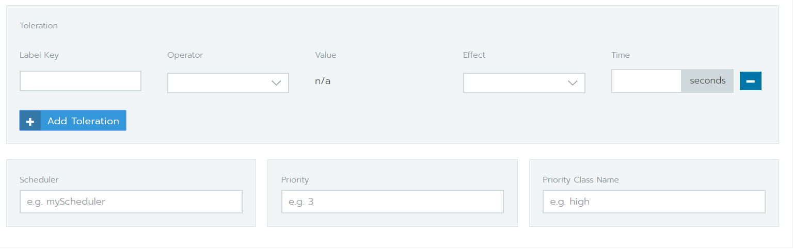

#### 6，健康检查

- 可以设置存活和就绪检查，默认是readliness 检查，设置完成后 存活检查也使用此规则；也可以点击右侧Define a separate liveness check增加一个存活检查。设置http和htpps方式检查 相对友好一下；tcp方式呢，可能应用占有端口还在，但已经不工作了；命令退出状态检查：需要提前把脚本放到镜像或挂载到容器中，执行此脚本后，返回码是否为0 作为判断的依据。

#### 7，卷

这个不做特殊说明了，基本都是docker的知识；这是强调一下，可以把证书、configmap、证书挂载到容器中；如果选择挂载新的持久卷，会让创建一个持久卷；如果挂载一个已存在的持久卷，需要先创建一个持久卷。挂载空数据卷（ephemeral volume）这个比较简单。

#### 8，更新策略

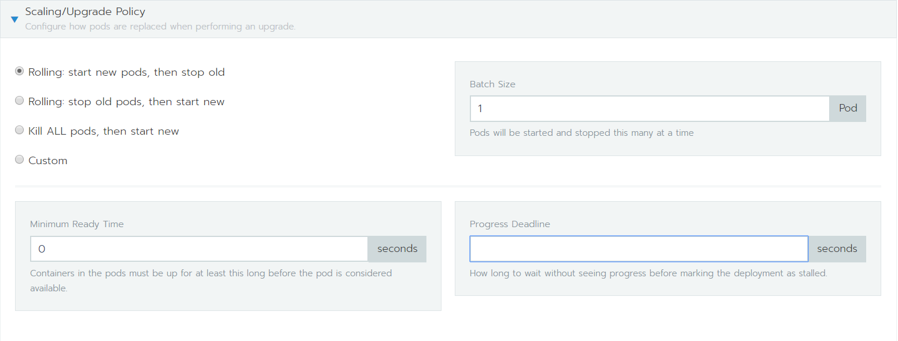

这个选择合适自己就行，如果这三种策略满足不了自己日常使用，可以自定义策略；默认选择" Rolling: start new pods, then stop old"  这个一般就能保证应用平滑更新；而且rancher UI上还支持回滚操作，很好保证了，升级错误能快速退回。

点击底部show advanced options后  ，能显示出剩下 使用频率相对较低配置项

#### 9，command

关于entrypoint和command用法 有单独一章博客讲解[docker run image -args对应yaml语法/rancher UI操作方式](k8s/docker-run-and-k8s-command.md)，这里不再赘述。

#### 10，网络（networking）

网络这块，可以修改使用主机网络空间，一些host别名，以及一些DNS解析等配置；

#### 11，标签和注解

主要是给此deploy下的pod打标签和注解的

#### 12，安全

这一块配置也很重要，由于容器为了安全，是和外部环境是隔离的，想使用某些资源，就需要关闭或开启一些安全策略；

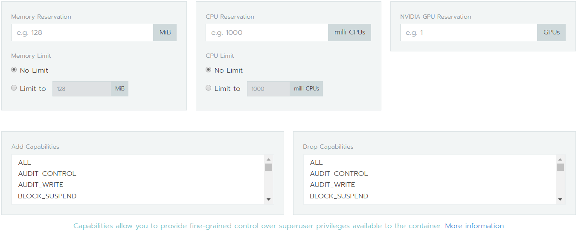

此模块还集成了资源限制和提权（最后的双侧复选框）；如果pod采用了HPA（水平扩展），一定要做好存活和资源限制配置。这样一旦触发了资源配置上线，就会自动扩展。

#### 13，菜单功能

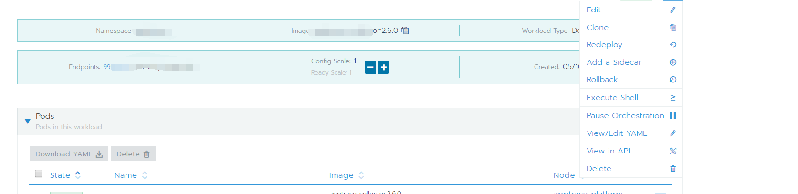

右上角菜单，也有很多功能；主要是编辑：修改deploy用的；clone：可以复制此deploy，然后做修改，保存。redeploy：重新部署，这个一般在configmap等更新后，可以重新部署一下。增加边车：可以增加一个辅助容器或者init容器；生效根据字面意思 就能知道它作用。

### 负载均衡配置（ingress）

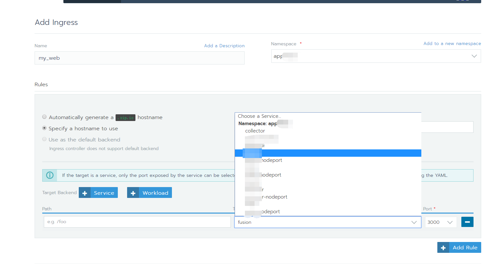

ingress其实也是一种service，相当于增加一个支持7层负载的nginx，并带有域名；nginx（也可以是其他代理软件甚至是硬件）把接收到请求反向代理到匹配的pod上。新增ingress时，可以选自定义生成的域名，也可以使用自己购买的域名； 选择目标，可以是service或者工作负载（workload）；证书、标签注解都能在此UI配置。

### 服务发现配置

service可以这么理解：通过标签的键值对，选择匹配的pod，然后用户或其他应用访问入口是service，service调度满足匹配条件的pod上。

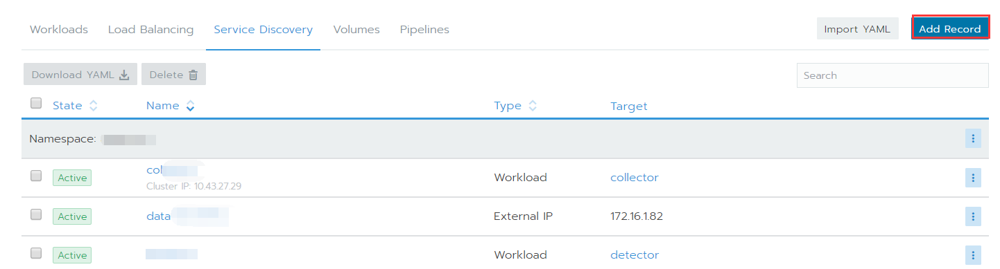

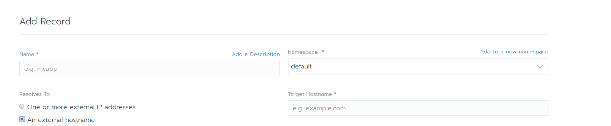

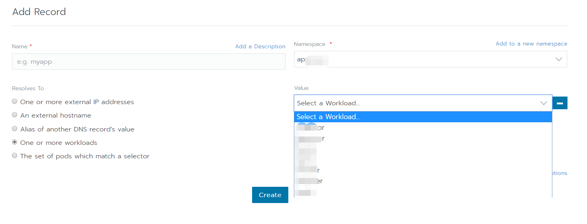

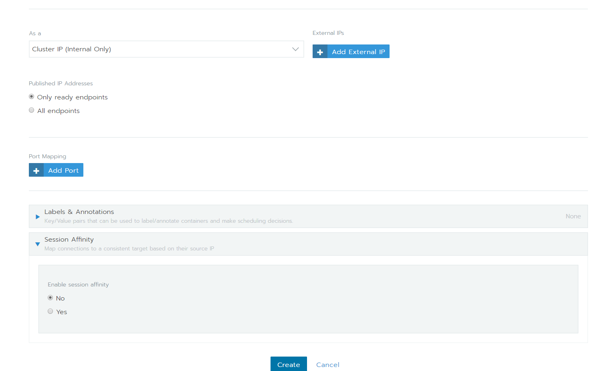

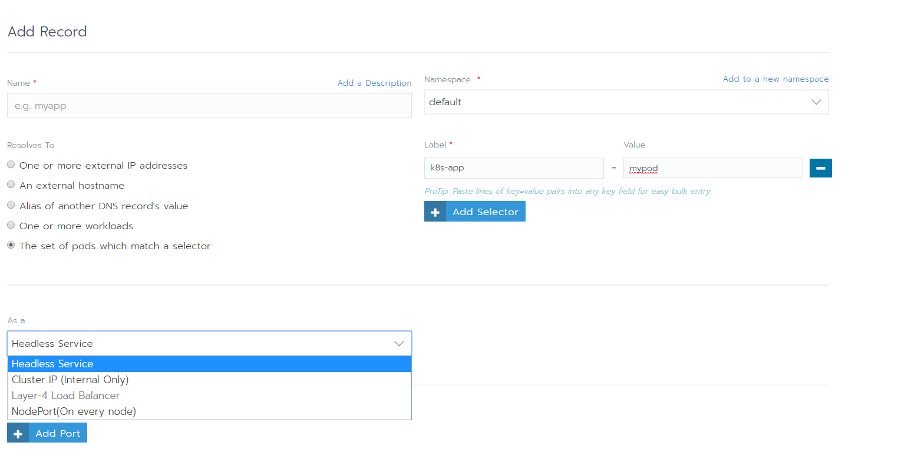

-   "One or more external IP addresses"和"An external hostname"  类似,把外部ip或者域名定义为内部dns，前者可以一次性定义多个ip，后者只能定义一个。如选择"One or more external IP addresses"类型，名称填写my-data;Target IP Addresses填写 172.17.1.4 ；此集群内部pod可以直接访问my-data，dns自动解析到172.17.1.4

-   "One or more workloads"和"The set of pods which match a selector"类似，前者相当于工作负载选择器，后者相当于标签选择器；前者通过标签选择工作负载（deployment、daemon-set、statefulset)，后者通过标签选择pod。

     在rancherUI部署应用如果采用nodeport，会自动产生两个service，一同名service，一个是加上“-nodeport”的service；如果不想使用rancherUI自动生成的service，可以自己定义一个“The set of pods which match a selector” 标签选择器,这里面再来定义cluster_ip 或nodeport；

- "Alias of another DNS record's value" 这个暂时没未深入研究。

### 数据卷

数据卷就是持久化存储的

添加数据卷，填写名称，选择提前定义好持久卷，就可以使用了。

定义持久卷可以在storage中定义，有持久卷和存储类两种类型

存储类是可以动态扩展的；持久卷一般定义多少，最大就能使用这么多。存储技术现在很多样，kubernetes（rancher）支持 这么多，可以提前搭建好后，直接使用（如何搭建不同存储平台，这里不做描述）。

### 其他配置

#### 资源

##### 证书

这个一般是存放CA或其他机构颁发证书、甚至是自定义的证书文件，如tls.key tls.pem这类文件的；最后可以通过volume的形式挂载到容器

##### configmap

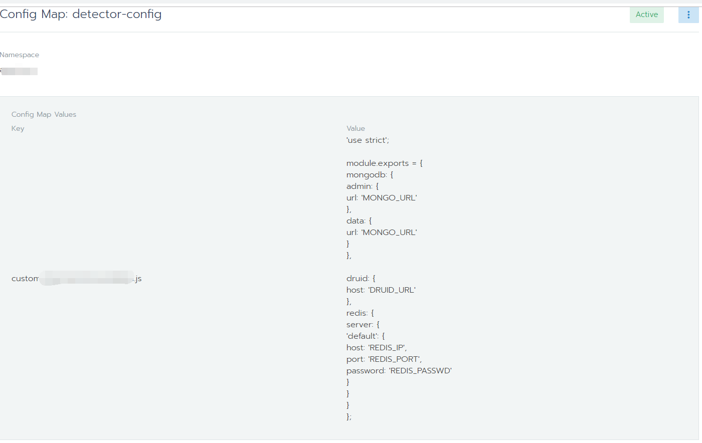

- 这个configmap  最常用的作用有两个，一个是编写环境变量，然后在工作负载部署时，环境变量可以直接引用此configmap，另一个就是存储应用配置文件，如上图；key就是配置文件名称，value就是配置文件内容；然后通过volume挂载到容器程序存放配置文件的地方。

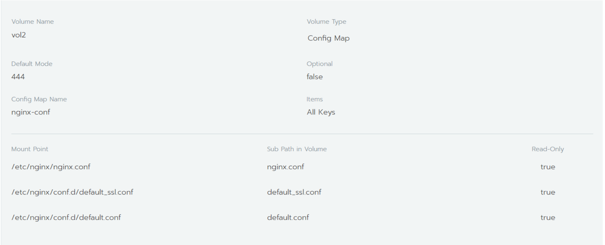

- 如部署nginx时有三个配置文件，都写到configmap后，再把三个配置文件（键值对） 都挂载容器同一个目录，并且覆盖掉容器里面配置文件，可以在Mount Point中直接填写路径（只保留配置文件路径，不接配置文件名），Sub Path in Volume中不填写任何内容；如果想把configmap的文件挂载到容器，同时容器中默认的文件不被删除（有同名文件除外），Sub Path in Volume 填写挂载到容器中文件要显示的名称即可； Optional和items是匹配的，Optional为true，items 才可以设置，这个一般是用来只把configmap中 部分文件挂载到容器中使用的；

##### 密文

- 这个一般用来存储敏感信息，比如密码；然后和configmap一样，可以通过环境变量引用，也可以通过volume挂载也可以；相对简单，操作一两遍 即可掌握。

### 命名空间和工具成员比较简单，略过

- rancherUI 能配置的就这么多，配置不了，可以通过编辑yaml，来手动填写

## 通过导入yaml部署应用

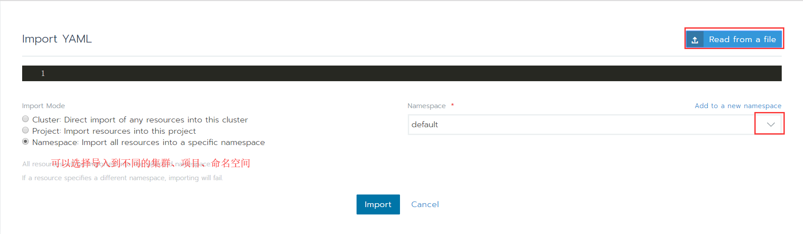

这个是最简单的，把写好的yaml文件，导入进来就可以了；导入后，如果有问题，根据日志或者event提示，修改调整一下即可。需要说明的时，如果导入时，没有配置文件里面命名空间，需要提前创建命名空间。如果导入yaml文件，有创建命名空间操作，不能和已有命名空间重名；并且导入后，需要给移动到某个项目中。