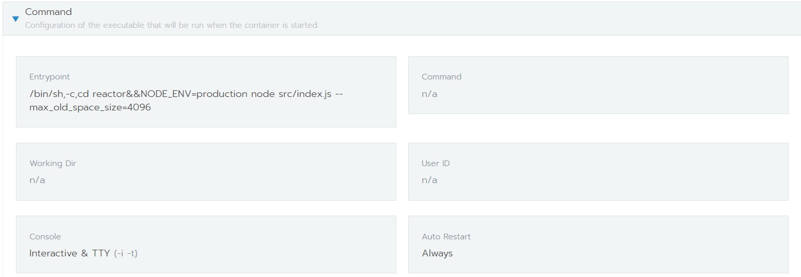

# 如何区分image与container中的entrypoint、cmd关系

不管是用kubernetes还是docker-compose来管理容器，其command参数相当于覆盖了镜像的entrypoint，args相当于覆盖了镜像的CMD；若采用编排工具管理容器，如果没有重新定义entrypoint和cmd，就默认使用镜像的entrypoint和cmd；如果容器编排工具中只使用了args参数，相当于image的entrypoint+编排工具定义args参数；如果容器中同时定义了 command和args ，容器入口就变成了command+args，image中定义的entrypoint和cmd会完全被覆盖掉。

## 如何对着docker run image -args,来填写容器编排配置（kubernetes、docker-compose)文件

  kubectl 与 Docker 命令关系 可以参考：http://docs.kubernetes.org.cn/70.html

  我们经常能在某个image官方文档中看到 像docker run image -args这种用法，这就行相当于改写了其entrypoint或cmd，那这些args若是在kubernetes或docker-compose的yaml中怎么配置呢，如：docker run -it xxx /bin/sh，相当于把入口变为/bin/sh; 

  还有像 redis 镜像官网说明: ```docker  run  redis  --requirepass  passwd```  运行一个带密码的容器；若在k8s的yaml、rancherUI（甚至是docker-compose）里面怎么配置呢，最简单办法 是查看这个镜像的dockerfile中的entrypoint ：docker-entrypoint.sh(只展示了部分代码)

```bash
if [ "${1#-}" != "$1" ] || [ "${1%.conf}" != "$1" ]; then 
 set -- redis-server "$@" 
 fi 
```


  从上面代码，可以看出如果参数不是“-”开头或者".conf"结尾，会自动变成redis-server + args（args为自定义的参数），若参数是“-”开头或“.conf”结尾，会直接用CMD命令+参数；所以在k8s（docker-compose)配置文件args里面可以直接跟参数，如果第一个参数写成了redis-server也没关系，镜像入口文件已做处理；也可以直接定义command，但必须以redis-server开头+参数；为何是redis-server开头呢，这个是从redis的镜像cmd中获得的。

   如果你使用rancher，直接在 UI界面，点击编辑-更多就会显示命令(Command)输入框，有两个输入框，分别是entrypoint和command；entrypoint对应yaml配置是command，command对应的yaml配置是args；



像redis加密，可以直接在rancher UI界面的command填写:--requirepass "自己的密码" 或redis-server --requirepass "自己的密码" ，甚至可以再entrypoint里面填写：redis-server --requirepass "自己的密码"  都可以，但不能在entrypoint中填写：--requirepass "自己的密码"。完成后可以验证，密码是否生效；
    有一种情况：如果没有找到镜像的dockerfile，当run镜像后，到容器中的默认的目录，查看是否有个可执行的二进制文件，然后在command 里面设置   “二进制文件  -args   ”但这个需要验证；

## 实战：

packetbeat 官网镜像 使用参考


```bash
docker run -d \

  --name=packetbeat \

  --user=packetbeat \

  --volume="/etc/localtime:/etc/localtime:ro" \

  --cap-add="NET_RAW" \

  --cap-add="NET_ADMIN" \

  --network=host \

  docker.elastic.co/beats/packetbeat:7.1.1 \

  --strict.perms=false -e \

  -E setup.kibana.host=ip:port \

  -E output.elasticsearch.hosts=ip:port
```


镜像后面的参数转换成配置文件

            args: [
              "--strict.perms=false",
              "-e",
              "-E","setup.kibana.host=ip:port",
              "-E","output.elasticsearch.hosts=ip:port"
            ]
如果使用rancher  直接UI上编辑 即可修改

