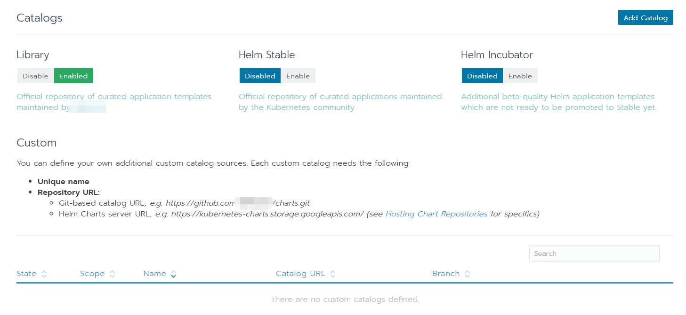
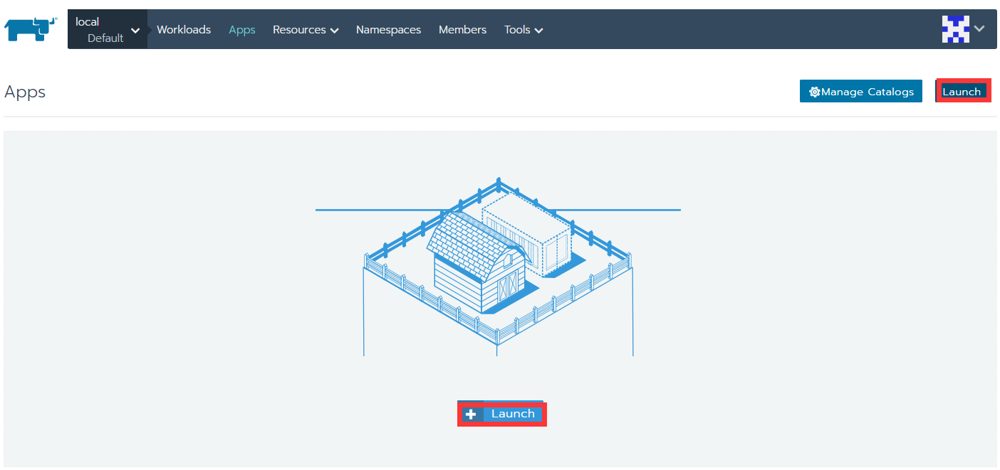
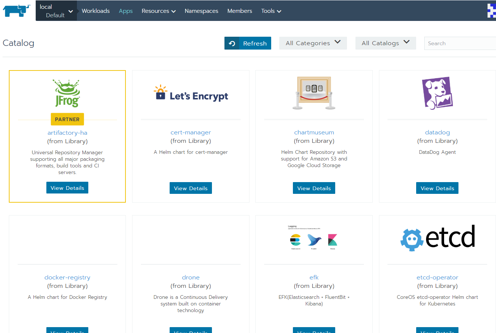
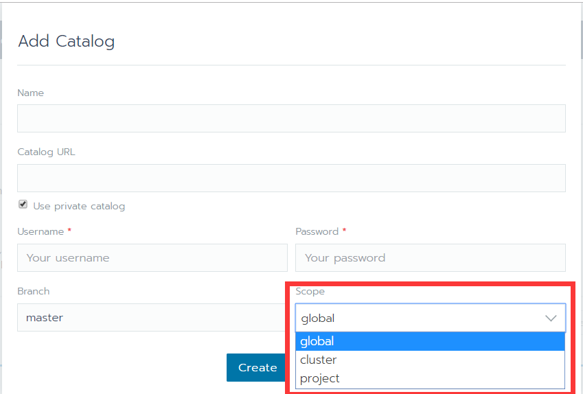
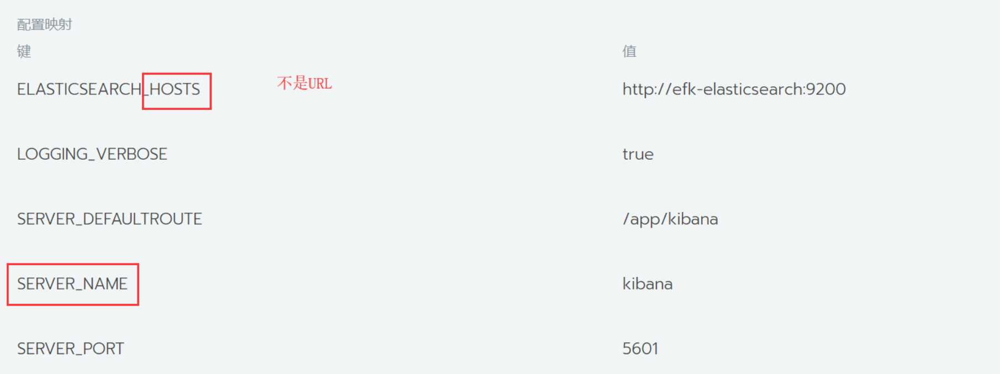
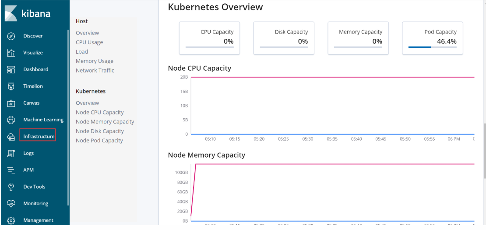

# rancher应用商店的使用

​    应用商店可以理解为helm源或charts仓库；启用后，找到自己要部署的应用，直接通过helm模板进行部署。在部署的时候 有些问答就是重置默认key-value配置的。

## 配置应用商店

### 全局启用、配置应用商店



默认只开启了基于Library源的应用商店，这个源由rancher官方维护，稳定性较强。"Helm Stable"由helm官方维护，稳定性也行，但没有针对rancher进行优化；"Helm Incubator"这个呢是helm社区维护的，稳定性一般。我们可以都设为enable后，进行使用

### 项目中启用应用商店



直接点击Launch，进行启用，启用后，会发现很多应用的helm源



### 添加其他charts仓库

可以添加自己私有chart仓库、以及其他企业的（如阿里、elastic、bitnami）到应用商店；



可以选择为全局、集群、项目三个范围内的资源，根据情况灵活添加，如果添加为项目范围的，只能在此项目中使用此helm源（商店）；使用私有helm源，需要提供用户名和密码；

下面罗列了几个比较重要的charts仓库地址。

```
阿里charts仓库         https://kubernetes.oss-cn-hangzhou.aliyuncs.com/charts

bitnami        https://charts.bitnami.com

elastic        <https://helm.elastic.co
```

如添加elastic helm源


应用商店搜索elastic


发现有很多Elastic-Helm提供的。

说了这么多，接下来真正的实战。

## 实战

### 利用rancher 应用商店搭建 elasticsearch+kibana+apm-server 

#### 应用商店搜索所需应用

rancher应用商店 搜索efk；我们选择来自Library，这个已经集成了elasticsearch+kibana+fluent；点击View Details,进入配置自定义页面。


命名空间，这些可以指定如果不知道就会部署到默认的efk中。

#### 选项配置：

jvm也可以根据情况来调整 ，默认512 m，就可以；调整1g的话，如果运行多个实例在一台机器 较吃力，如果机器性能好，可以适当调整大一些。使用默认镜像选择false后，就可以指定镜像，这里面镜像版本相对落后，从elastic官网镜像<https://www.docker.elastic.co/#>获取到当前最新稳定版，然后填写进去（这里镜像名称和tag输入框不在一起）。 这里不需要f(luent),就不启用，镜像名称也无需修改了。


#### 调整与完善

##### elasticsearch参数调整

自定义配置完成后点击launch，待镜像都拉取完成后；根据提示继续完善和调整。这里面elasticsearch组件默认使用的是空数据，我们如果修改为持久卷的话 ，不管是主机是映射，还是持久申明的卷，都要给777权限


  我这里没有搭建存储平台，就采用了本地Local Node Path做的持久卷（和主机目录映射差别不大）， 主机映射那个目录只能被1个elasticsearch使用，所以configmap中，变量discovery.zen.minimum_master_nodes 此处修改为1；（这样把elasticsearch主机调度到一台机器上就行了）；discovery.type  =  single-node  如果上个参数修改为1的话，discovery.zen.ping.unicast.hosts 这个配置在7.0版本后已经不建议使用了 ，也可以去掉

若继续使用默认的空数据卷，elasticsearch单pod也可以按照这种方式修改，具体环境变量参数看截图（在Resources-config maps中可以找到这些变量）


注：node.data=true 这个参数要添加上，避免多次安装出现的问题


##### kibana参数调整

首先查看对应镜像版本，说明文档<https://www.elastic.co/guide/en/kibana/7.1/docker.html#environment-variable-config>

```
Docker defaultsedit
The following settings have different default values when using the Docker images:

server.name

kibana

server.host

"0"

elasticsearch.hosts

http://elasticsearch:9200

xpack.monitoring.ui.container.elasticsearch.enabled

true
```


然后和kibana的configmaps中定义环境变量参数对比一下




**若还想调整es和kibana日志 也可以在环境变量中设置**

- kibana的设置：

```
LOGGING_QUIET		true	 	

LOGGING_VERBOSE		false	
```

- es设置：

`logger.org.elasticsearch.transport  	warn`


#### 部署apm-server

应用商店继续搜索：apm-server，直接进入查看详情页面，然后把此应用 指定到和efk 应用同一个命名空间里


#####   apm-server 配置文件和环境变量的调整

   到secrets（有的是config  map）进行配置， 有个名称为apm-server.yml 的key，其value按照如下修改，把数据写入文件的配置改为写入到elasticsearch中。


另外，需要在环境变量中 加入两个参数：

```
setup.dashboards.enabled=true  

config.output.file.enabled=false 
```

因为这个在应用商店安装的apm-server，默认是把数据存到file的，前面修改了输出为elasticsearch，这里再把输入到文件设为false；（自己手动部署的 并不需要，应用商店的需要检查一下）

- **查看apm-server，进行验证**


然后点击Launch APM，就可以使用了。如果根据页面提示把apm-agent 嵌入被测应用后，再查看apm-server采集到的数据


若探针采集的数据已经发送过来了 点击进去可以查看详细数据；


### 手动部署filebeat+metricbeat+packetbeat向es发送数据

#### 部署filebeat

这个其镜像详情里面就提供k8s部署的yaml，稍作修改就可以使用

<https://www.elastic.co/guide/en/beats/filebeat/版本号/running-on-kubernetes.html>

下载所需yaml后，修改里面命名空间到自己制定的空间 ，直接在rancher中部署完成后修改输出elasticsearch地址（config maps中）,如果是在环境变量中定义elasticsearch地址，直接就在环境变量中修改，这个视情况而定。

#### 部署metricbeat

这个有点复杂些，官方也提供了(具体下载根据版本情况）k8s所需的yaml文件：

<https://www.elastic.co/guide/en/beats/metricbeat/6.6/running-on-kubernetes.html>

把官网提供的yaml下载下来后，用rancher导入到kube-system空间中；

他会部署两个metricbeat，一个daemonset  一个deployment，deployment可以暂停；如果没有kube-state-metrics组件，因为设定了依赖关系，他也会自动部署一个；然后修改配置文件config-map ,第一个配置文件metricbeat.yml：设置抓取的信息要输入到正确的elasticsearch和kibana中


或es输入直接设置为  

`output.elasticsearch.hosts: ['${ELASTICSEARCH_HOST}']  `

把多余的变量删除掉，直接把ELASTICSEARCH_HOST 在环境变量中定义为 http://es_ip:port

第二个配置文件kubernetes.yml 

```yaml
module: kubernetes

  metricsets:

​    \- node

​    \- system

​    \- pod

​    \- container

​    \- volume

  period: 10s

  host: ${NODE_NAME}

  \#hosts: ["localhost:10255"]

  \# If using Red Hat OpenShift remove the previous hosts entry and 

  \# uncomment these settings:

  hosts: ["https://${HOSTNAME}:10250"]

  ssl.verification_mode: "none"

  ssl.certificate_authorities:

​    \- /etc/kubernetes/ssl/certs/serverca

  ssl.certificate: "/etc/kubernetes/ssl/kube-node.pem"

  ssl.key: "/etc/kubernetes/ssl/kube-node-key.pem"


```

- 需要注意地方:

第一个hosts: ["localhost:10255"]  修改为hosts: ["https://${HOSTNAME}:10250"]

参照<https://www.elastic.co/guide/en/beats/metricbeat/current/running-on-kubernetes.html>红帽的配置方法

然后把/etc/kubernetes/ssl/certs/serverca、/etc/kubernetes/ssl/kube-node.pem和/etc/kubernetes/ssl/kube-node-key.pem 在工作负载界面通过主机映射挂载进去就行了 （如果没有这些证书文件，是无法从相关接口获取数据，这些文件都是用来鉴权的）。

最后在环境变量中把正确的es地址信息填写进去就可以了


#### 部署kube-state-metrics

  如上图中用到kube-state-metrics的数据，没有的话，会自动部署一个；但kube-state-metrics没有部署成功，后者提供的镜像有问题怎么解决呢；

  我们可以从https://github.com/kubernetes/kube-state-metrics/blob/master/kubernetes/kube-state-metrics-deployment.yaml  找到正确的镜像文件名称，对照修改镜像名称为：quay.io/coreos/kube-state-metrics:v1.5.0 即可完成部署（现在可能是1.6版本了）。这个地址也有部署需要的各种yaml文件，需要注意不同的版本；我们把 kube-state-metrics-service.yaml、kube-state-metrics-service-account.yaml、kube-state-metrics-deployment.yaml  等所有yaml文件下载下来，先导入SA(service-account)类的yaml，剩下的yaml再逐个导入； 由于master版本可能不确定是那个版本，建议选用release中的具体版本；通过rancher把这些yaml导入到系统空间"kube-system"

  yaml文件里面多个镜像仓库是谷歌的，如果你没有科学上网的方法，就像我一样，换成其他公司同名镜像；如image: k8s.gcr.io/addon-resizer:1.8.3，可以在dockerhub上搜到其他公司提供的;image: siriuszg/addon-resizer:1.8.4，我没有搜索到1.8.3 就选更高版本的1.8.4的了，一般原则是相同版本，然后dockerhub排名较高的镜像

- 部署完成后，把kube-state-metrics的8080端口映射出来，我们通过浏览器访问验证一下：

访问kube-state-metrics页面会显示健康 "/health" 相关指标。

- 最终采集到的数据在kibana呈现验证：

  

#### 部署：packetbeat

这个相对简单，官方只提供的了docker的部署方式，我们对着参数 部署到rancher即可：

<https://www.elastic.co/guide/en/beats/packetbeat/current/load-kibana-dashboards.html>

```bash
docker run --net="host" docker.elastic.co/beats/packetbeat:7.2.0 setup --dashboards
```

入口命令怎么在rancherUI里面配置，单独一章博客有介绍[image和container中的entrypoint、cmd关系](docker-run-and-k8s-command.md)

另外还要增加 `--strict.perms=false -e -E output.elasticsearch.hosts=ip:port`使数据发送到之前搭建的es里面，`--net=host`  在rancherUI对应的操作是：networking模块把"Use Host's Network Namespace"设为真;


packetbeat是用来采集host（宿主）机器的数据，部署到容器中，有些数据可能抓取不到;可能需要提权,也可以在rancherUI最后配置项"Add Capabilities" 里面把下面两项增加上。

```
  --cap-add="NET_RAW" \

  --cap-add="NET_ADMIN" \
```

经过多次验证，把如下文件挂载到容器，基本和在host（宿主）机器上部署packetbeat效果一样。

```yaml
volumeMounts:
        - name: cgroup
          mountPath: /host/sys/fs/cgroup/
          readOnly: true
        - name: proc
          mountPath: /host/proc/
          readOnly: true
        - name: docker-sock
          mountPath: /var/run/docker.sock
          readOnly: true
      volumes:
      - name: cgroup
        hostPath:
          path: /sys/fs/cgroup/
      - name: proc
        hostPath:
          path: /proc/
      - name: docker-sock
        hostPath:
          path: /var/run/docker.sock

```

## 最后有一点要注意

把主机时间也映射到所有的容器中，避免容器时间不一致导致的一系列问题。

