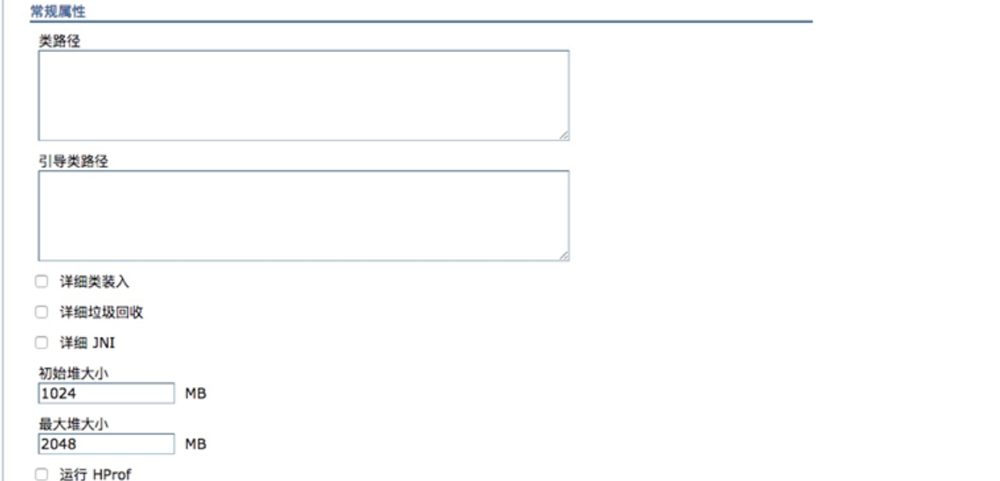

# tomcat was weblogic jvm参数调整

## tomcat

### linux

可以在bin目录下，新增一个setenv.sh文件，添加如下内容

```
JAVA_OPTS="$JAVA_OPTS  -Xms1g -Xmx1g"

或者

export CATALINA_OPTS="$CATALINA_OPTS -Xms1g -Xmx1g"
```

也可以直接在catalina.sh中修改，使用`JAVA_OPTS="$JAVA_OPTS  -Xms1g -Xmx1g"`

### windonws

set "JAVA_OPTS=%JAVA_OPTS% -Xms1g -Xmx1g"

Windows 变量用%%包围起来，要带上set（相当于export）

## websphere（was）

在WebSphere服务器管理界面，依次点击`应用程序服务器 > server1 > 进程定义 > Java 虚拟机`目录，通用JVM参数区域内填写如下参数；





### weblogic

在启动脚本 里面增加

`export JAVA_OPTIONS="$JAVA_OPTIONS -Xms1g -Xmx1g"`

或者新增一个启动脚本，里面增加上面代码，并调用启动脚本。

- Windows 系统：

  把export换成set   变量用%包起来就行了；