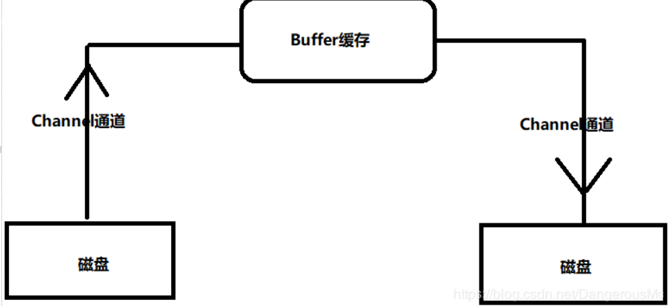
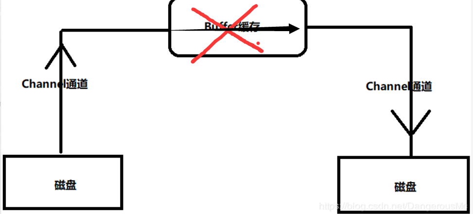

# 利用NIO复制文件

  本文主要目的是利用NIO技术复制文件，然后说明NIO比IO操作先进性，对输出输入流的操作从jdk1.7版本以前的IO方式转换到NIO上来。

在上一章[NIO和IO遍历指定目录效果对比](middleware/NIO-IO-diff.md)已经说明了NIO 中的Path、Paths、Files等 用他们操作文件的便捷性。这一章主要讲NIO对输入输出流的操作。

## NIO对流的操作概述

NIO工具是jdk1.7引入的，绝大部分场景下，替换IO工具使用，是没有问题，而且更高效。

NIO对流的操作，主要引入了 Buffer、Channel、Selector,三大功能组件。这里主要说明Buffer和Channel；

- Buffer抽象类有许多子类，ByteBuffer、CharBuffer、DoubleBuffer、FloatBuffer、IntBuffer、LongBuffer和ShortBuffer类都是Buffer的子类，其中最常用的子类就是ByteBuffer

- Channel接口主要实现类主要有：FileChannel、DatagramChannel、SocketChannel、ServerSocketChannel 等，这个相当于流的管道。

  

  

下面就来用FileChannel和ByteBuffer来实现复制一个9.21M的文件；

```java
public void copyTestSecond(){
    long start = System.currentTimeMillis();
    FileInputStream fis = null;
    FileOutputStream fos = null;
    FileChannel src = null;
    FileChannel dest = null;
    try {
        //实例化输入、输出流
        fis = new FileInputStream("d:\\adbdriver.zip");//文件9.21M
        fos = new FileOutputStream("d:\\adbdriver2.zip");
        //获取输出、输入流的Channel（可以理解为管道）
        src = fis.getChannel();
        dest = fos.getChannel();
        //定义buffer，可以理解为缓冲池，Bytebuffer 是个抽象类，不可用new 实例化对象
        //可以用ByteBuffer的类方法 实例化一个对象
        ByteBuffer buffer = ByteBuffer.allocate(1024);
        while (src.read(buffer) != -1){
            //目前buffer是空，切换到读取模式,然后开始读取
            buffer.flip();
            //待buffer把src中的数据读取完后 再写入到dest Channel中
            //相当于把水先通过一个叫src的channel中流到缓冲池中buffer中，
            //然后从buffer中放入到一个叫dest的channel里
            dest.write(buffer);
            //把缓冲池buffer清空
            buffer.clear();

        }

    } catch (FileNotFoundException e) {
        e.printStackTrace();
    } catch (IOException e) {
        e.printStackTrace();
    }finally {
        //关闭各种流和channel通道
        if(src != null){
            try {
                src.close();
            } catch (IOException e) {
                e.printStackTrace();
            }
        }
        if(dest != null){
            try {
                dest.close();
            } catch (IOException e) {
                e.printStackTrace();
            }
        }
        if(fis != null){
            try {
                fis.close();
            } catch (IOException e) {
                e.printStackTrace();
            }
        }
        if(fos != null){
            try {
                fos.close();
            } catch (IOException e) {
                e.printStackTrace();
            }
        }
    }

    long end = System.currentTimeMillis();
    System.out.println("total time is: "+(end-start));  //195
}
```

耗时195毫秒；

Channel还有更骚的操作，可以不需要Buffer，流从一端流向另一端，如图：



代码实现：

```java
public void copyTest(){
    long start = System.currentTimeMillis();
    FileChannel src = null;
    FileChannel dest = null;
    try {
        //要读取的文件，对文件有读操作
        src = FileChannel.open(Paths.get("d:\\adbdriver.zip"),StandardOpenOption.READ);
        //要写入的文件，要有读、追加内容、创建的权限
        dest = FileChannel.open(Paths.get("d:/adbdriver3.zip"),
                StandardOpenOption.READ,StandardOpenOption.WRITE,StandardOpenOption.CREATE);
        //读取到文件 写入到目标文件中
        src.transferTo(0,src.size(),dest);
        //同样 也可以写作目标文件从什么文件转入进来
        //dest.transferFrom(src,0,src.size());


    } catch (IOException e) {
        e.printStackTrace();
    }finally {
       if(src != null){
           try {
               src.close();
           } catch (IOException e) {
               e.printStackTrace();
           }
       }
        if(dest != null){
            try {
                dest.close();
            } catch (IOException e) {
                e.printStackTrace();
            }
        }
    }
    long end = System.currentTimeMillis();
    System.out.println("total time is: "+(end-start));  //28
}
```

这个耗时只有28毫秒

NIO对流的操作，丰富多样；而且是异步的，可以实现边写边读；而传统的IO则比较费劲，只能先把文件读入到流，然后再写入到另一个流中。